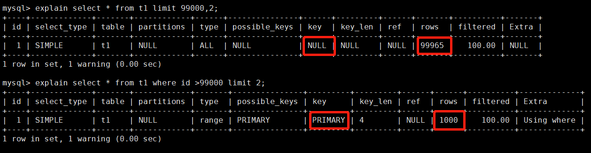
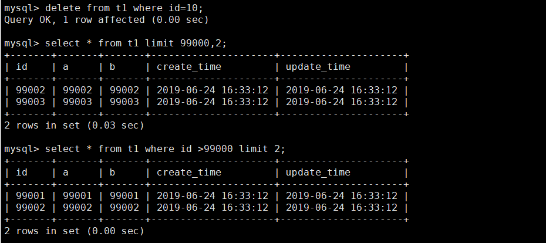
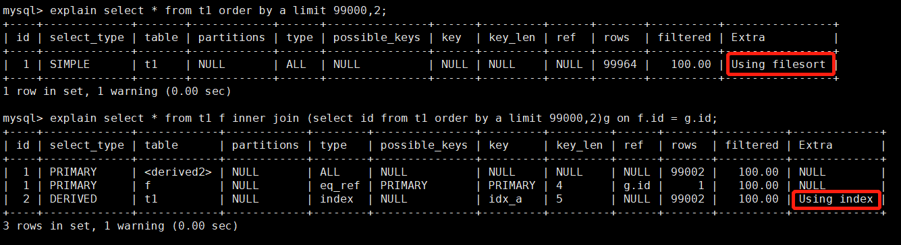
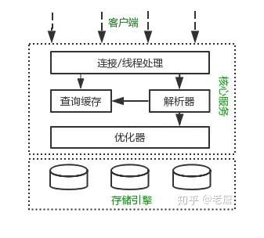
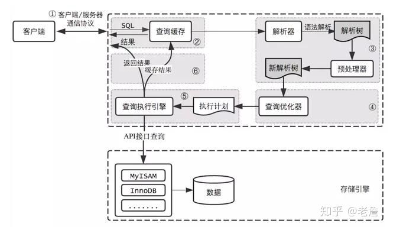
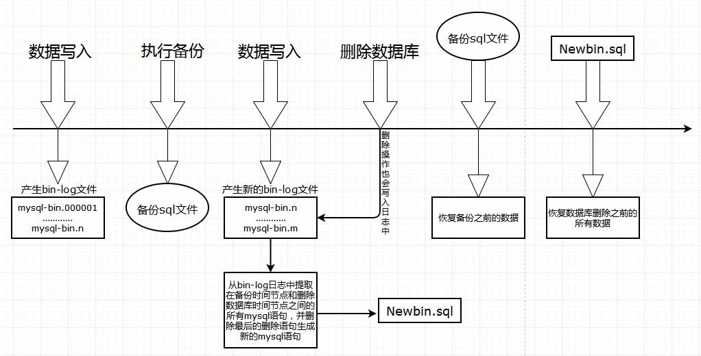

# MYSQL 问题
## 性能

### mysql插入性能分析

插入行所需的时间由以下因素决定（参考MySQL 5.7参考手册：8.2.4.1优化INSERT语句）

- 连接：30%
- 向服务器发送查询：20%
- 解析查询：20%
- 插入行：10% * 行的大小
- 插入索引：10% * 索引数
- 结束：10%

大部分时间耗费在客户端与服务端通信的时间，因此可以使用 insert 包含多个值来减少客户端和服务器之间的通信。

**加快mysql大量数据插入方法**

1. 一次插入多行的值；
2. 关闭自动提交，多次插入数据的 SQL 一次提交；
3. 调整参数，innodb_flush_log_at_trx_commit 和 sync_binlog 都设置为0（当然这种情况可能会丢数据）

### order by排序

order by两种排序方式：

- 有序索引
	- 效率最高
- filesort排序
	- 物理上分为两种种实现方式,自动采用哪种取决于排序的数据大小和`sort_buffer_size`配置的大小
		- “排序的数据大小” < `sort_buffer_size`: 内存排序
		- “排序的数据大小” > `sort_buffer_size`: 磁盘排序
	- 算法上分为三种
		- `< sort_key, rowid >`
			- 双路排序：根据sql语句取出要查询的字段和id，在sort buffer排好序后再去数据库取出行所有字段
			> 1. 从索引 a 找到第一个满足 a = 1000 的主键 id
			> 2. 根据主键 id 取出整行，把排序字段 d 和主键 id 这两个字段放到 sort buffer 中
			> 3. 从索引 a 取下一个满足 a = 1000 记录的主键 id
			> 4. 重复 3、4 直到不满足 a = 1000
			> 5. 对 sort_buffer 中的字段 d 和主键 id 按照字段 d 进行排序
			> 6. 遍历排序好的 id 和字段 d，按照 id 的值回到原表中取出 a、c、d 三个字段的值返回给客户端
		- `< sort_key, additional_fields >`
			- 单路排序：直接取出对应行所有字段在sort buffer进行排序
			> 1. 从索引 a 找到第一个满足 a = 1000 条件的主键 id
			> 2. 根据主键 id 取出整行，取出 a、c、d 三个字段的值，存入 sort_buffer 中
			> 3. 从索引 a 找到下一个满足 a = 1000 条件的主键 id
			> 4. 重复步骤 2、3 直到不满足 a = 1000
			> 5. 对 sort_buffer 中的数据按照字段 d 进行排序
			> 6. 返回结果给客户端
		- `< sort_key, packed_additional_fields >`
			- 类似单路排序，只是char和varchar在sort buffer中排序前进行压缩
		- MySQL 通过比较系统变量 `max_length_for_sort_data` 的大小和需要查询的字段总大小来判断使用哪种排序模式。
			- 如果 `max_length_for_sort_data` 比查询字段的总长度大，那么使用 `< sort_key, additional_fields >`排序模式；
			- 如果 `max_length_for_sort_data` 比查询字段的总长度小，那么使用 `<sort_key, rowid>` 排序模式。
		- 单路排序会把所有需要查询的字段都放到 sort buffer 中，而双路排序只会把主键和需要排序的字段放到 sort buffer 中进行排序，然后再通过主键回到原表查询需要的字段。

#### order by 优化

1. 添加索引
	- 可以在排序字段上添加索引来优化排序语句。
	- 如果多个字段排序，可以在多个排序字段上添加联合索引来优化排序语句。
	- 先等值查询再排序的语句，可以通过在条件字段和排序字段添加联合索引来优化此类排序语句。
2. 去掉不必要的返回字段
	- 查询所有字段不走索引的原因是：扫描整个索引并查找到没索引的行的成本比扫描全表的成本更高，所以优化器放弃使用索引。
3. 修改参数
	- `max_length_for_sort_data`：如果觉得排序效率比较低，可以适当加大`max_length_for_sort_data` 的值，让优化器优先选择全字段排序。当然不能设置过大，可能会导致 CPU 利用率过低或者磁盘 I/O 过高；
	- `sort_buffer_size`：适当加大 `sort_buffer_size` 的值，尽可能让排序在内存中完成。但不能设置过大，可能导致数据库服务器 SWAP。
4. 避免无法走索引的情况：
	- 使用范围查询再排序`explain select id,a,b from t1 where a>9000 order by b;`
		
		> 联合索引中前面的字段使用了范围查询，对后面的字段排序使用不了索引排序。a、b 两个字段的联合索引，对于单个 a 的值，b 是有序的。而对于 a 字段的范围查询，也就是 a 字段会有多个值，取到 a，b 的值 b 就不一定有序了，因此要额外进行排序。
	- ASC 和 DESC 混合使用将无法使用索引

group by语句默认情况，会对 group by 字段排序，因此优化方式与 order by 基本一致，如果目的只是分组而不用排序，可以指定 order by null 禁止排序。

### 分页查询
`select a,b,c from t1 limit 10000,10;`

表示从表 t1 中取出从 10001 行开始的 10 行记录。看似只查询了 10 条记录，实际这条 SQL 是先读取 10010 条记录，然后抛弃前 10000 条记录，然后读到后面 10 条想要的数据。因此要查询一张大表比较靠后的数据，执行效率是非常低的。

分页查询两种情形：

1. 根据自增且连续主键排序的分页查询
  - 原始
  	- `select * from t1 limit 99000,2;`
  	- 表示查询从第 99001开始的两行数据，没添加单独 order by，表示通过主键排序。
  - 改进:
    - ```sql
      select * from t1 where id >99000 limit 2;
      
      SELECT * FROM table WHERE id BETWEEN 1000000 AND 1000010;
      ```

    - 改进后走主键索引

    - </br>

    - 对于主键不连续的情况下不适用，表中可能某些记录被删后，主键空缺，导致结果不一致

    - </br>
2. 查询根据非主键字段排序的分页查询
  - 原始
    - ```sql
      select * from t1 order by a limit 99000,2;
      ```

    - 原因：扫描整个索引并查找到没索引的行的成本比扫描全表的成本更高，所以优化器放弃使用索引。
  - 优化
  	- 让排序时返回的字段尽可能少
  	- `select * from t1 f inner join (select id from t1 order by a limit 99000,2)g on f.id = g.id;`
  	- </br>

### join 表
join关联查询主要分为三种算法,mysql会自动选择小表作为驱动表：

1. Nested-Loop Join
	- 每次从驱动表中取出一行，用这行的关联数据去被驱动表中查找
	- 仅当被驱动表中有关联数据的索引时才使用此算法，不然此算法查找次数为n*m（驱动和被驱动表行数分别为n和m）
2. Block Nested-Loop Join
	- 先把驱动表数据读入`join_buffer`，然后对被驱动表进行逐行扫描与`join_buffer`中的数据作对比
	- 表查找次数为n+m,计算次数为n*m，所以当被驱动表没有建立索引时此方式查找次数少很多
3. Batched Key Access
	- 将驱动表中相关列放入 join_buffer 中
	- 批量将关联字段的值发送到 Multi-Range Read(MRR) 接口
	- MRR 通过接收到的值，根据其对应的主键 ID 进行排序，然后再进行数据的读取和操作

优化：
	- 在被驱动表的关联字段上添加索引;让 BNL变成 NLJ 或者 BKA ，可明显优化关联查询。
	- 小表做驱动表;小表驱动大表（默认）
	- 临时表;当遇到 BNL 的 join 语句，如果不方便在关联字段上添加索引，不妨尝试创建临时表，然后在临时表中的关联字段上添加索引，然后通过临时表来做关联查询。

### count()函数
count(a)和count()相比前者不会计算a=null的行，后者会返回所有行记录。

InnoDB中不会记录表中的行数，因为并发事务可能导致同事读取到不同的行数

mysql5.7后通过遍历最小的可用二级索引来处理count()语句，如果不存在二级索引，则扫描聚簇索引。原因是 InnoDB 二级索引树的叶子节点上存放的是主键，而主键索引树的叶子节点上存放的是整行数据，所以二级索引树比主键索引树小。因此优化器基于成本的考虑，优先选择的是二级索引。所以 **count(主键) 其实没 count (*)** 快。

几种优化 count() 的方式：
 - show table status：能快速获取结果，但是结果不准确；
- 用 Redis 做计数器：能快速获取结果，比 show table status 结果准确，但是并发场景计数可能不准确；
- 增加 InnoDB 计数表：能快速获取结果，利用了事务特性确保了计数的准确，也是比较推荐的方法。

### mysql 优化

优化核心目的：

- 最大化利用索引
- 尽可能避免全表扫描；
- 减少无效数据的查询

SELECT : 

> **避免不走索引的case（避免全表扫描）**：
>
> 1. 避免在字段开头模糊查询
>
>    - ```sql
>      SELECT * FROM t WHERE username LIKE '%陈%'
>      ```
>
>    - 使用FullText全文索引，用match against 检索
>
>    - 数据量较大的情况，建议引用ElasticSearch、solr，亿级数据量检索速度秒级
>
>    - 使用MySQL内置函数INSTR(str,substr) 来匹配，作用类似于java中的indexOf()，查询字符串出现的角标位置
>
> 2. 避免使用in 和not in
>
>    - 如果数值连续用between代替
>    - 如果是子查询，可以用exists代替
>
> 3. 首先应考虑在 where 及 order by 涉及的列上建立索引。
>
>    - 当order by 中的字段出现在where条件中时，才会利用索引而不再二次排序，更准确的说，order by 中的字段在执行计划中利用了索引时，不用排序操作。
>
> 4. 避免进行 null 判断 或者 使用 != 或 <> 操作符
>
>    - null可以通过给字段添加默认值
>
> 5. 避免使用 or 来连接条件，如果一个字段有索引，一个字段没有索引，将导致引擎放弃使用索引而进行全表扫描
>
>    - 可以用union代替or
>
> 6. 避免在 where 子句中对字段进行表达式操作，这将导致引擎放弃使用索引而进行全表扫描
>
> 7. **索引并不是越多越好，可以提高 select 效率，同时也降低 insert 及 update 的效率，因为 insert 或 update 时有可能会重建索引，表的索引数最好不要超过6个**
>
> 8. 尽可能的使用 varchar/nvarchar 代替 char/nchar ，因为变长字段存储空间小，可以节省存储空间
>
> 9. 不要返回用不到的任何字段
>
> 10. 尽量避免大事务操作，提高系统并发能力。

SELECT 其他：

> 1. 避免出现 select * , 仅返回需要的列
> 2. 多表关联查询时，小表在前，大表在后。
>    - 执行 from 后的表关联查询是从左往右执行的（Oracle相反），第一张表会涉及到全表扫描，所以将小表放在前面，先扫小表，扫描快效率较高，在扫描后面的大表，或许只扫描大表的前100行就符合返回条件并return了。
> 3. 调整Where字句中的连接顺序
>    - MySQL采用从左往右，自上而下的顺序解析where子句。根据这个原理，应将过滤数据多的条件往前放，最快速度缩小结果集。
> 4.  用where字句替换HAVING字句
>    - 避免使用HAVING字句，因为**HAVING只会在检索出所有记录之后才对结果集进行过滤，而where则是在聚合前刷选记录**，如果能通过where字句限制记录的数目，那就能减少这方面的开销。HAVING中的条件一般用于聚合函数的过滤，除此之外，应该将条件写在where字句中
>    - where和having的区别：where后面不能使用组函数

DML语句优化（增删改）：

> 1. 批量插入语句合并
> 2. 适当使用commit， 减少事务占用消耗
> 3. 避免重复查询更新的数据

查询条件优化：

> 1. 对于复杂的查询，可以使用中间临时表 暂存数据
> 2. 优化group by
> 3. 优化join
> 4. 优化union

建表语句：

> 1. 在表中建立索引，优先考虑where、order by使用到的字段
> 2. 尽量使用数字型字段
>    - 因为引擎在处理查询和连接时会 逐个比较字符串中每一个字符，而对于数字型而言只需要比较一次就够了
> 3. 用varchar/nvarchar 代替 char/nchar
>    - 首先变长字段存储空间小，可以节省存储空间，其次对于查询来说，在一个相对较小的字段内搜索效率显然要高些。null也会占用固定空间， 如果是varchar这样的变长字段， null 不占用空间。


> https://www.cnblogs.com/yunfeifei/p/3850440.html

## 索引

没使用索引的原因：

1. 建立组合索引，但查询谓词并未使用组合索引的第一列，此处有一个INDEX SKIP SCAN概念。
2. 在包含有null值的table列上建立索引，当时使用select count(*) from table时不会使用索引。
3. 在索引列上使用函数时不会使用索引（包括类型转换），如果一定要使用索引只能建立函数索引。
	
	> 索引树中存储的是列的实际值和主键值。如果拿 ‘表达式内的值’ 去匹配，将无法定位到索引树中的值。因此放弃走索引，而选择全表扫描。
4. 并不是所有情况使用索引都会加快查询速度，full scan table 有时会更快，尤其是当查询的数据量占整个表的比重较大时，因为full scan table采用的是多块读
5. 如果条件中有or，即使其中有条件带索引也不会使用。换言之，就是要求使用的所有字段，都必须建立索引，我们建议大家尽量避免使用or 关键字 
6. 模糊查询条件
	> 通配符在最前面不使用索引如`select * from t1 where a like '%1111%';`</br>
	> 修改后则走索引`select * from t1 where a like '1111%';`</br>
	> 如果条件只知道中间的值，需要模糊查询去查，那就建议使用ElasticSearch或其它搜索服务器。
7. 范围查询中条件范围过大
	
	> 优化器会根据检索比例、表大小、I/O块大小等进行评估是否使用索引。比如单次查询的数据量过大，优化器将不走索引,可以将一次大范围查询分为多次小范围查询
8. 计算操作
	> 对索引字段做运算将使用不了索引。</br>
	> `explain select * from t1 where b-1 =1000;`</br>
	> 可以将计算操作放在等号后面</br>
	> `explain select * from t1 where b =1000 + 1;`

</br>

### 需要添加索引的情况

1. 数据查询检索
	- `select * from t9_1 where d = 90000;`
2. 聚合函数
	- `select max(d) from t9_1;`
3. 排序
	- 如果对单个字段排序，则可以在这个排序字段上添加索引来优化排序语句；
	- 如果是多个字段排序，可以在多个排序字段上添加联合索引来优化排序语句；
	- 如果是先等值查询再排序，可以通过在条件字段和排序字段添加联合索引来优化排序语句。
4. 避免回表
	- 通过辅助索引来寻找数据，InnoDB 存储引擎会遍历辅助索引树查找到对应记录的主键，然后通过主键索引回表去找对应的行数据。
	- 条件字段和需要查询的字段有联合索引的话，其实回表这一步就省了，因为联合索引中包含了这两个字段的值。像这种索引就已经覆盖了我们的查询需求的场景，我们称为：覆盖索引
5. 关联查询
	- 过在关联字段添加索引，让 BNL变成 NLJ 或者 BKA。

### 主键

#### 为什么要设置主键

缺少主键或者非空索引：

- 使用不了主键索引，查询会进行全表扫描
- 影响数据插入性能，插入数据需要生成ROW_ID（6字节），而生成的ROW_ID是全局共享的，并发会导致锁竞争，影响性能

#### 主键自增好还是UUID

- 自增ID：innodb 中的主键是聚簇索引。自增主键每次插入新的记录，会顺序添加到当前索引节点的后续位置，一页写满自动开辟新页。
- UUID：可能在**中间插入引发页的分裂，产生很多表碎片**！**（性能差）**

#### 主键id用完怎么办

- 自定义自增主键id： 4个字节，用完后，再次申请id，得到的值保持不变。插入数据会报主键冲突异常。
- 系统自动生成row_id:  big int，8个字节，但是系统**只分给他6个字节，用完了从0开始循环计数**，**再插入时就会覆盖掉原来的数据**。

#### **主键为什么不推荐有业务含义?**

- 任何有业务含义的列都有改变的可能性，主键一旦发生变更，存储位置就会发生变更，有可能会引发页分裂，产生空间碎片。
- 带有业务含义的主键，不一定是顺序自增的。后面插入数据的主键比前面的小，就有可能引发页分裂，产生空间碎片。

#### **字段为什么要定义为NOT NUL**

- 索引性能不好：**Mysql难以优化引用可空列查询，它会使索引、索引统计和值更加复杂。可空列需要更多的存储空间，还需要mysql内部进行特殊处理。可空列被索引后，每条记录都需要一个额外的字节，还能导致MYisam 中固定大小的索引变成可变大小的索引**
- 查询会出现一些不可预料的结果：count不会计算null数量

### 千万级别数据需要多高的b+树

 **InnoDB 页的大小默认是 16k**，单条记录（一行）大多1K，那么一个B+树叶子节点能存放 

```java
16K/1k = 16
```

条数据。

假设主键 ID 为 bigint 类型，长度为 8 字节，而指针大小在 InnoDB 源码中设置为 6 字节，这样一共 14 字节，那么一个非叶节点能存放指针的数量：

```java
16384/14 = 1170
```

那么一个三层B+树能够存放数据量： 

```java
1170 * 1170 * 16 = 21902400（条） = 2千万（条）
```


### hash比B+树快，为什么不用hash做索引

hash不支持范围查询；且索引一般放在磁盘中数据量大无法一次加载到内存，B+树允许分批加载


## 锁
### 全局锁和表锁什么场景下会用到
#### 全局锁
MySQL 全局锁会关闭所有打开的表，并使用全局读锁锁定所有表,当执行 FTWRL 后，所有的表都变成只读状态，数据更新或者字段更新将会被阻塞

> `FLUSH TABLES WITH READ LOCK`</br>
> 简称`FTWRL`</br>
> 解锁`UNLOCK TABLES`

全局锁一般用在整个库（包含非事务引擎表）做备份（mysqldump 或者 xtrabackup）时。也就是说，在整个备份过程中，整个库都是只读的，其实这样风险挺大的。如果是在主库备份，会导致业务不能修改数据；而如果是在从库备份，就会导致主从延迟。

好在 mysqldump 包含一个参数 --single-transaction，可以在一个事务中创建一致性快照，然后进行所有表的备份。因此增加这个参数的情况下，备份期间可以进行数据修改。但是需要所有表都是事务引擎表。所以这也是建议使用 InnoDB 存储引擎的原因之一。

而对于 xtrabackup，可以分开备份 InnoDB 和 MyISAM，或者不执行 --master-data，可以避免使用全局锁。
#### 表锁
表锁分为表锁和元数据锁两种

使用场景：

- 事务需要更新某张大表的大部分或全部数据。如果使用默认的行锁，不仅事务执行效率低，而且可能造成其它事务长时间锁等待和锁冲突，这种情况下可以考虑使用表锁来提高事务执行速度；
- 事务涉及多个表，比较复杂，可能会引起死锁，导致大量事务回滚，可以考虑表锁避免死锁。
其中表锁又分为表读锁和表写锁，命令分别是：

表锁分为两种：

- 表读锁：
	
	> 对表执行 lock tables xxx read （表读锁）时，本线程和其它线程可以读，本线程写会报错，其它线程写会等待
- 表写锁：
	
	> 对表执行 lock tables xxx write （表写锁）时，本线程可以读写，其它线程读写都会阻塞

元数据锁：
> 在 MySQL 中，DDL 是不属于事务范畴的。如果事务和 DDL 并行执行同一张表时，可能会出现事务特性被破坏、binlog 顺序错乱等 bug,由此引入了引入了元数据锁（Metadata Locking，简称：MDL 锁）</br>
> MDL不需要显式使用，在访问一个表的时候会被自动加上。MDL的作用是，保证读写的正确性。


虽然 MDL 锁是系统默认加的，但是却不能忽略一个机制，比如下面一个例子：可能会给一个小表加字段，导致整个库都挂了。

你肯定知道，给一个表加字段、或者修改字段、或者加索引，需要扫描全表的数据。对大表操作的时候，你肯定会特别小心，以免对线上服务造成影响。而实际上，即使是小表，操作不慎也会出现问题。

比如sessionA、sessionB、sessionC、sessionD 依次执行，一个 sessionA 先启动，这个时候会对表 t 加一个 MDL 读锁，由于 sessionB 需要的也是 MDL 读锁，读锁之间不互斥，因此可以正常执行。之后 sessionC 会被阻塞，因为事务中的 MDL 锁，在语句执行开始时申请，但是语句结束后并不会马上释放，而是等到事务提交之后再释放。所以 sessionA 读锁还没有释放而 sessionC需要一个写锁，因此只能被阻塞。

如果说 sessionC 自己阻塞了没有关系，但是之后所有要在表 t 上心申请 MDL 读锁的请求也会被 sessionC 阻塞，就等于这个表完全不可读写了。如果某个表上的查询语句频繁，而且客户端有重试机制，超时之后再重启一个 session，这个库的线程很快就会爆满。

基于上面的分析，我们来讨论一个问题，如何安全地给小表加字段 ？

首先要解决长事务，事务不提交，就会一直占着 MDL 锁， 在 MySQL 的 information_schema 库的 innodb_trx 表中，你可以查看当前执行中的事务。如果你要做 DDL 变更的表刚好有长事务在执行，要考虑先暂停 DDL，或者 kill 掉这个长事务。

但考虑一下这个场景，如果你要变更的表是一个热点表，虽然数据量不大，但是上面的请求很频繁，你不得不加字段，你该怎么做呢？这个时候 kill 可能也未必管用，因为新的请求马上就来了。比较理想的机制是，在 alter table 语句里设定等待时间，如果在这个指定时间里面能够拿到 MDL 写锁最好，拿不到也不要阻塞后面的业务语句，先放弃，之后开发人员或者 DBA 再通过重试命令重复这个过程。

### 行锁：InnoDB 替代 MyISAM 的重要原因

早起关系型数据库采用两段锁模式：加锁->解锁，执行语句加锁，事务结束解锁，语句执行完并不立即解锁。

1. 通过非索引字段查询
	> 在 MySQL 中，如果一个条件无法通过索引快速过滤，那么存储引擎层面就会将所有记录加锁后返回，然后由 server 层进行过滤。因此也就把所有记录都锁上了。当然 MySQL 在这里有一些改进的，在 server 层过滤掉不满足条件的数据后，会把不满足条件的记录放锁。保证了最后只会持有满足条件的锁，但是每条记录的加锁操作还是不会省略。
	
	> 没有索引的情况下，InnoDB 的当前读会对所有记录都加锁。所以在工作中应该特别注意 InnoDB 这一特性，否则可能会产生大量的锁冲突。
	> 
	> 在更新数据时，如果条件字段没索引，则表中所有记录都会被加上 X 锁

2. 通过唯一索引查询
	
	> 如果查询的条件是唯一索引，那么 SQL 需要在满足条件的唯一索引上加锁，并且会在对应的聚簇索引上加锁。
3. 通过非唯一索引查询
	
	> 如果查询的条件是非唯一索引，那么 SQL 需要在满足条件的非唯一索引上都加上锁，并且会在它们对应的聚簇索引上加锁。

### 间隙锁意义

间隙锁定是锁定索引记录之间的间隙，或者锁定第一个和最后一个记录之间的间隙。组织其他事务将值插入到这个间隙中来，间隙可能跨越单个索引值，多个索引值，也有可能为空。

**可重复读（RR）级别下才会有间隙锁！！！！**

间隙锁定之间不存在冲突关系，这点也很重要。如果一个事务对某个间隙中间加了锁，那么其他事务也可以在这个间隙中加锁，这些操作不冲突。他的存在，仅仅是为了防止其他事务在这个间隙中插入记录。

- 间隙锁锁定的是某个索引记录之前和之后的一个间隙范围。
- 间隙锁之间互不影响，可以在锁定的区间再次添加间隙锁。
- 间隙锁可能造成死锁

当字段是唯一索引或者主键的时候，间隙锁产生的规则如下：

- 如果查询的结果中包含这个记录，那么在另外的会话上插入该记录前后间隙的记录时，不会产生间隙锁
- 如果查询的结果中不包含这个记录，那么在另外的会话上插入该记录前后间隙的记录时，会产生间隙锁。

## Mysql查询过程
</br>
</br>

### 客户端/服务端通信协议
MySQL客户端/服务端通信协议是“半双工”的：在任一时刻，要么是服务器向客户端发送数据，要么是客户端向服务器发送数据，这两个动作不能同时发生。一旦一端开始发送消息，另一端要接收完整个消息才能响应它，所以我们无法也无须将一个消息切成小块独立发送，也没有办法进行流量控制。

客户端用一个单独的数据包将查询请求发送给服务器，所以当查询语句很长的时候，需要设置max_allowed_packet参数。但是需要注意的是，如果查询实在是太大，服务端会拒绝接收更多数据并抛出异常。

与之相反的是，服务器响应给用户的数据通常会很多，由多个数据包组成。但是当服务器响应客户端请求时，客户端必须完整的接收整个返回结果，而不能简单的只取前面几条结果，然后让服务器停止发送。因而在实际开发中，尽量保持查询简单且只返回必需的数据，减小通信间数据包的大小和数量是一个非常好的习惯，这也是查询中尽量避免使用SELECT *以及加上LIMIT限制的原因之一。

### 查询缓存

在解析一个查询语句前，如果查询缓存是打开的，那么MySQL会检查这个查询语句是否命中查询缓存中的数据。如果当前查询恰好命中查询缓存，在检查一次用户权限后直接返回缓存中的结果。这种情况下，查询不会被解析，也不会生成执行计划，更不会执行。

MySQL将缓存存放在一个引用表（不要理解成table，可以认为是类似于HashMap的数据结构），通过一个哈希值索引，这个哈希值通过查询本身、当前要查询的数据库、客户端协议版本号等一些可能影响结果的信息计算得来。所以两个查询在任何字符上的不同（例如：空格、注释），都会导致缓存不会命中。

如果查询中包含任何用户自定义函数、存储函数、用户变量、临时表、mysql库中的系统表，其查询结果都不会被缓存。MySQL的查询缓存系统会跟踪查询中涉及的每个表，如果这些表（数据或结构）发生变化，那么和这张表相关的所有缓存数据都将失效。正因为如此，在任何的写操作时，MySQL必须将对应表的所有缓存都设置为失效。如果查询缓存非常大或者碎片很多，这个操作就可能带来很大的系统消耗，甚至导致系统僵死一会儿。而且查询缓存对系统的额外消耗也不仅仅在写操作，读操作也不例外：

- 任何的查询语句在开始之前都必须经过检查，即使这条SQL语句永远不会命中缓存
- 如果查询结果可以被缓存，那么执行完成后，会将结果存入缓存，也会带来额外的系统消耗

基于此，我们要知道并不是什么情况下查询缓存都会提高系统性能，缓存和失效都会带来额外消耗，只有当缓存带来的资源节约大于其本身消耗的资源时，才会给系统带来性能提升。如果系统确实存在一些性能问题，可以尝试打开查询缓存，并在数据库设计上做一些优化，比如：

- 用多个小表代替一个大表，注意不要过度设计
- 批量插入代替循环单条插入
- 合理控制缓存空间大小，一般来说其大小设置为几十兆比较合适
- 可以通过SQL_CACHE和SQL_NO_CACHE来控制某个查询语句是否需要进行缓存

最后的忠告是不要轻易打开查询缓存，特别是写密集型应用。如果你实在是忍不住，可以将query_cache_type设置为DEMAND，这时只有加入SQL_CACHE的查询才会走缓存，其他查询则不会，这样可以非常自由地控制哪些查询需要被缓存。

[[玩转MySQL之四]MySQL缓存机制](https://zhuanlan.zhihu.com/p/55947158)

## 日志

MySQL日志分类:

- 错误日志
    > 记录信息：
    >   - 服务器启动和关闭过程中的信息</br>
    >   - 服务器运行过程中的错误信息
    >   - 事件调度器运行一个事件时产生的信息
    >   - 在从服务器上启动从服务器进程时产生的信息
    >       - 在复制环境下，从服务器进程的信息也会被记录进错误日志</br>
    > 
    > 默认开启，无法被禁止。存储在数据库的数据文件目录中，名称为hostname.err，其中，hostname为服务器主机名。
- 查询日志(通用日志)
    > 查询日志里面记录了数据库执行的所有命令，不管语句是否正确，都会被记录，会导致IO非常大，影响MySQL性能,因此如果不是在调试环境下，是不建议开启查询日志功能的。</br>
    >
    > 查询日志的开启有助于帮助我们分析哪些语句执行密集，执行密集的select语句对应的数据是否能够被缓存，同时也可以帮助我们分析问题
- 慢查询日志
  
    >  开启慢查询日志，可以让MySQL记录下查询超过指定时间的语句，能够很好的优化数据库性能。默认情况下不开启.
- 事务日志(Redo log)
    > innodb通过force log at commit机制实现事务的持久性，即在事务提交的时候，必须先将该事务的所有事务日志写入到磁盘上的redo log file和undo log file中进行持久化。
    >
    > 分为：
    > 
    > - 重做日志redo
    >     - redo log包括两部分：一是内存中的日志缓冲(redo log buffer)，该部分日志是易失性的；二是磁盘上的重做日志文件(redo log file)，该部分日志是持久的，并且是事务的记录是顺序追加的，性能非常高.为了确保每次日志都能写入到事务日志文件中，在每次将log buffer中的日志写入日志文件的过程中都会调用一次操作系统的fsync操作(即fsync()系统调用)。
    >     - MySQL通过变量 `innodb_flush_log_at_trx_commit` 的值来自定义在commit时如何将log buffer中的日志刷log file中。该变量有3种值：0、1、2，默认为1。但注意，这个变量只是控制commit动作是否刷新log buffer到磁盘。
    >       - 当设置为0的时候，事务提交时不会将log buffer中日志写入到os buffer，而是每秒写入os buffer并调用fsync()写入到log file on disk中。也就是说设置为0时是(大约)每秒刷新写入到磁盘中的，当系统崩溃，会丢失1秒钟的数据。
    >       - 当设置为1的时候，事务每次提交都会将log buffer中的日志写入os buffer并调用fsync()刷到log file on disk中。这种方式即使系统崩溃也不会丢失任何数据，但是因为每次提交都写入磁盘，IO的性能较差。
    >       - 当设置为2的时候，每次提交都仅写入到os buffer，然后是每秒调用fsync()将os buffer中的日志写入到log file on disk。
    >     - 在主从复制结构中，要保证事务的持久性和一致性，下述两项变量的设置保证了：每次提交事务都写入二进制日志和事务日志，并在提交时将它们刷新到磁盘中。
    >       - 如果启用了二进制日志，则设置sync_binlog=1，即每提交一次事务同步写到磁盘中
    >       - 总是设置`innodb_flush_log_at_trx_commit=1`，即每提交一次事务都写到磁盘中
    > - 回滚日志undo
    >     - undo log有两个作用：提供回滚和多个行版本控制(MVCC)。undo log默认存放在共享表空间中。
    >       - 提供回滚
    >          - 在数据修改的时候，不仅记录了redo，还记录了相对应的undo，如果因为某些原因导致事务失败或回滚了，可以借助该undo进行回滚。undo log和redo log记录物理日志不一样，它是逻辑日志。可以认为当delete一条记录时，undo log中会记录一条对应的insert记录，反之亦然，当update一条记录时，它记录一条对应相反的update记录。
    >       - 多个行版本控制(MVCC)
    >          - 应用到行版本控制的时候，也是通过undo log来实现的：当读取的某一行被其他事务锁定时，它可以从undo log中分析出该行记录以前的数据是什么，从而提供该行版本信息，让用户实现非锁定一致性读取。
- 二进制日志(binlog)
	> 一个二进制文件，主要记录所有数据库表结构变更（例如CREATE、ALTER TABLE…）以及表数据修改（INSERT、UPDATE、DELETE…）的所有操作。二进制日志（binary log）中记录了对MySQL数据库执行更改的所有操作，并且记录了语句发生时间、执行时长、操作数据等其它额外信息，但是它不记录SELECT、SHOW等那些不修改数据的SQL语句。
	> 
	> - 作用：
	>    - 恢复（recovery）：某些数据的恢复需要二进制日志。例如，在一个数据库全备文件恢复后，用户可以通过二进制日志进行point-in-time的恢复。
	>    - 复制（replication）：其原理与恢复类似，通过复制和执行二进制日志使一台远程的MySQL数据库（一般称为slave或者standby）与一台MySQL数据库（一般称为master或者primary）进行实时同步。
	>    - 审计（audit）：用户可以通过二进制日志中的信息来进行审计，判断是否有对数据库进行注入攻击。
	>    - 崩溃保持一致性：在开启binlog的情况下，为了保证binlog与redo的一致性，MySQL将采用事务的两阶段提交协议。当MySQL系统发生崩溃时，事务在存储引擎内部的状态可能为prepared和commit两种。对于prepared状态的事务，是进行提交操作还是进行回滚操作，这时需要参考binlog：如果事务在binlog中存在，那么将其提交；如果不在binlog中存在，那么将其回滚，这样就保证了数据在主库和从库之间的一致性。
	> - 记录格式：
	>    - STATEMENT
	>       - 记录的是数据库上执行的原生SQL语句，好处就是相当简单，简单地记录和执行这些语句，能够让主备保持同步，在主服务器上执行的SQL语句，在从服务器上执行同样的语句。另一个好处是二进制日志里的时间更加紧凑，所以相对而言，基于语句的复制模式不会使用太多带宽，同时也节约磁盘空间。并且通过mysqlbinlog工具容易读懂其中的内容。
	>       - 坏处就是同一条SQL在主库和从库上执行的时间可能稍微或很大不相同，因此在传输的二进制日志中，除了查询语句，还包括了一些元数据信息，如当前的时间戳。即便如此，还存在着一些无法被正确复制的SQL。存储过程和触发器在使用基于语句的复制模式时也可能存在问题。另外一个问题就是基于语句的复制必须是串行化的。这要求大量特殊的代码，配置，例如InnoDB的next-key锁等。并不是所有的存储引擎都支持基于语句的复制。
	>    - ROW
	>       - 基于数据的复制，基于行的更改。这种方式会将实际数据记录在二进制日志中，它有其自身的一些优点和缺点，最大的好处是可以正确地复制每一行数据。一些语句可以被更加有效地复制，另外就是几乎没有基于行的复制模式无法处理的场景，对于所有的SQL构造、触发器、存储过程等都能正确执行。
	>       - 主要的缺点就是二进制日志可能会很大，而且不直观，所以，你不能使用mysqlbinlog来查看二进制日志。也无法通过看二进制日志判断当前执行到那一条SQL语句了。
	>    - MIXED
	>       - MIXED也是MySQL默认使用的二进制日志记录方式，但MIXED格式默认采用基于语句的复制，一旦发现基于语句的无法精确的复制时，就会采用基于行的复制。比如用到UUID()、USER()、CURRENT_USER()、ROW_COUNT()等无法确定的函数。


- 中继日志
	
	> relay log是复制过程中产生的日志，很多方面都跟binary log差不多，区别是: relay log是从库服务器I/O线程将主库服务器的二进制日志读取过来记录到从库服务器本地文件，然后从库的SQL线程会读取relay-log日志的内容并应用到从库服务器上。


### bin log与redo log区别

1. `bin log`会记录所有日志记录，包括InnoDB、MyISAM等存储引擎的日志；`redo log`只记录innoDB自身的事务日志。 
2. `bin log`只在事务提交前写入到磁盘，一个事务只写一次；而在事务进行过程，会有`redo log`不断写入磁盘。 
3. `bin log`是逻辑日志，记录的是SQL语句的原始逻辑；`redo log`是物理日志，记录的是在某个数据页上做了什么修改。


[玩儿转MYSQL之日志分类及简介](https://zhuanlan.zhihu.com/p/58011817)

### mysql数据库恢复过程
</br>

1. 准备工作
	- 查看是否开启binlog二进制日志和数据库是否有备份。
2. 利用数据库备份还原数据表结构
3. 查看binlog日志列表，找到备份最后修改时间戳的对应日志文件
	- `show master logs；`
4. 备份导出日志文件
	- `mysqlbinlog mysql-bin.000011 > bak.log`
5. 根据删除命令时间导出需要执行的日志
	- `mysqlbinlog --stop-datetime="2019-09-07 17:30:31" mysql-bin.000011 >all.sql`


### binlog三种格式

1. **Row Level 行模式**：记录每一行数 据被修改的形式，然后在slave端再对相同的数据进行修改
   - 优点：
     - 会非常清楚的记录下每一行数据修改的细节，不记录执行的sql语句的上下文相关的信息
   - 缺点：
     - 会产生大量日志内容
2. **Statement Level**（默认模式）：记录会修改数据的sql
   - 优点：
     - 减小日志体积
   - 缺点：
     - 会造成MySQL的复制出现问题，主要是修改数据的时候使用了某些定的函数或者功能的时候会出现。
3. **Mixed 自动模式**：根据sql语句来区分对待记录，update或者delete等修改数据的语句，使用行模式


### MVCC实现原理

通过 `read view` 和版本链实现的；版本链保存有历史版本记录，通过`read view` 判断当前版本的数据是否可见，如果不可见，再从版本链中找到上一个版本，继续进行判断，直到找到一个可见的版本。

版本链通过表的三个隐藏字段实现：

- `DB_TRX_ID`：当前事务id，通过事务id的大小判断事务的时间顺序。 
- `DB_ROLL_PRT`：回滚指针，指向当前行记录的上一个版本，通过这个指针将数据的多个版本连接在一起构成`undo log`版本链。 
- `DB_ROLL_ID`：主键，如果数据表没有主键，InnoDB会自动生成主键。

使用事务更新行记录的时候，就会生成版本链，执行过程如下：

1. 用排他锁锁住该行； 
2. 将该行原本的值拷贝到`undo log`，作为旧版本用于回滚； 
3. 修改当前行的值，生成一个新版本，更新事务id，使回滚指针指向旧版本的记录，这样就形成一条版本链。


在`read view`内部维护一个活跃事务[链表]()，表示生成`read view`的时候还在活跃的事务。这个[链表]()包含在创建`read view`之前还未提交的事务，不包含创建`read view`之后提交的事务。

不同隔离级别创建read view的时机不同。

- read committed：每次执行select都会创建新的read_view，保证能读取到其他事务已经提交的修改。
- repeatable read：在一个事务范围内，第一次select时更新这个read_view，以后不会再更新，后续所有的select都是复用之前的read_view。这样可以保证事务范围内每次读取的内容都一样，即可重复读。


`DATA_TRX_ID` 表示每个数据行的最新的事务ID；`up_limit_id`表示当前快照中的最先开始的事务；`low_limit_id`表示当前快照中的最慢开始的事务，即最后一个事务。

如果`DATA_TRX_ID` < `up_limit_id`：说明在创建`read view`时，修改该数据行的事务已提交，该版本的记录可被当前事务读取到。 

如果`DATA_TRX_ID` >= `low_limit_id`：说明当前版本的记录的事务是在创建`read view`之后生成的，该版本的数据行不可以被当前事务访问。此时需要通过版本链找到上一个版本，然后重新判断该版本的记录对当前事务的可见性。 

如果`up_limit_id` <= `DATA_TRX_ID` < `low_limit_i`：  

1. 需要在活跃事务[链表]()中查找是否存在ID为`DATA_TRX_ID`的值的事务。 
2. 如果存在，因为在活跃事务[链表]()中的事务是未提交的，所以该记录是不可见的。此时需要通过版本链找到上一个版本，然后重新判断该版本的可见性。 
3. 如果不存在，说明事务trx_id 已经提交了，这行记录是可见的。


## explain 调优

> https://segmentfault.com/a/1190000023565685
>
> https://segmentfault.com/a/1190000022780861?utm_source=sf-similar-article

explain字段

- id ：select查询的序列号，包含一组数字，表示查询中执行select子句或操作表的顺序
- select_type ：查询类型 或者是 其他操作类型
  - `SIMPLE`：简单查询（不包括子查询和`union`查询）
  - `PRIMARY`： 当存在子查询时，最外面的查询被标记为主查询
  - `SUBQUERY`:  子查询
  - `UNION` :  当一个查询在`UNION`关键字之后就会出现`UNION`
- table ：正在访问哪个表
- partitions ：匹配的分区
- type ：访问的类型
- possible_keys ：显示可能应用在这张表中的索引，一个或多个，但不一定实际使用到
- key ：实际使用到的索引，如果为NULL，则没有使用索引
- key_len ：表示索引中使用的字节数，可通过该列计算查询中使用的索引的长度
- ref ：显示索引的哪一列被使用了，如果可能的话，是一个常数，哪些列或常量被用于查找索引列上的值
- rows ：根据表统计信息及索引选用情况，大致估算出找到所需的记录所需读取的行数
- filtered ：查询的表行占表的百分比
- Extra ：包含不适合在其它列中显示但十分重要的额外信息

### type种类

性能依次递减：

```
NULL > system > const > eq_ref > ref > ref_or_null > index_merge > range > index > ALL
```

- `NULL`: **不用访问表或索引**，不查询索引也不查询表那你的数据是从哪里来的啊？谁说`SELECT`语句必须查询某样东西了？当你要查询最大值或者最小值时，MySQL会直接到你的索引得分叶子节点上直接拿，所以不用访问表或者索引。

  - ```sql
    SELECT MAX(id) FROM student
    ```

- `system`： 表只有一行记录（等于系统表），这是`const`类型的特列，平时不大会出现，可以忽略。

- `const`：表示直接按主键或唯一键读取，通过索引一次就找到。比较`primary key`或`uique`索引，因为只匹配一行数据，所以很快，如主键置于`where`列表中，MySQL就能将该查询转换为一个常量。

- `eq_ref`： 按联表的主键或唯一键联合查询。多表`join`时，对于来自前面表的每一行，在**当前表中只能找到一行**。

- `ref` ：单表扫描或者连接。如果是连接的话，驱动表的一条记录能够在被驱动表中通过非唯一（主键）属性所在索引中匹配多行数据，或者是在单表查询的时候通过非唯一（主键）属性所在索引中查到一行数据。

- `ref_or_null` ：类似ref，但是可以搜索值为`NULL`的行

- `index_merge：` 表示查询使用了两个以上的索引，最后取交集或者并集，常见`and `，`or`的条件使用了不同的索引，官方排序这个在`ref_or_null`之后，但是实际上由于要读取多个索引，性能可能大部分时间都不如`range`。

  - ```sql
    SELECT * FROM student AS S WHERE S.`name` LIKE "张%" OR S.`age` = 30
    ```

- `range`： 索引范围查询，常见于使用 =, <>, >, >=, <, <=, IS NULL, <=>, BETWEEN, IN()或者like等运算符的查询中。

  - ```sql
    SELECT S.`age` FROM student  AS S WHERE S.`age` > 30
    ```

- `index`： `index`只遍历索引树，通常比`All`快。因为，索引文件通常比数据文件小，也就是虽然`all`和`index`都是读全表，但`index`是从索引中读取的，而`all`是从硬盘读的。

  - ```sql
    SELECT S.`name` FROM student AS S 
    ```

- `ALL` ：如果一个查询的`type`是`All`,并且表的数据量很大，那么请解决它！！！

### Extra字段

- `Using filesort` :**对没有建立索引的数据进行排序**，只能使用外部的索引排序，外部排序就不断的在磁盘和内存中交换数据，这样就摆脱不了很多次磁盘IO，以至于SQL执行的效率很低。
- `Using tempporary`： **排序时使用了临时表**,这样的查询效率是**比外部排序更低**的，常见于`order by`和`group by`
- `Using index`： 表示使用了索引，很优秀👍。
- `Using where` ：使用了`where`但是好像没啥用。
- `Using join buffer`： 表明使用了连接缓存,比如说在查询的时候，多表`join`的次数非常多，那么将配置文件中的缓冲区的`join buffer`调大一些。
- `impossible where`： 筛选条件没能筛选出任何东西
- `distinct` ：优化`distinct`操作，在找到第一匹配的元组后即停止找同样值的动作