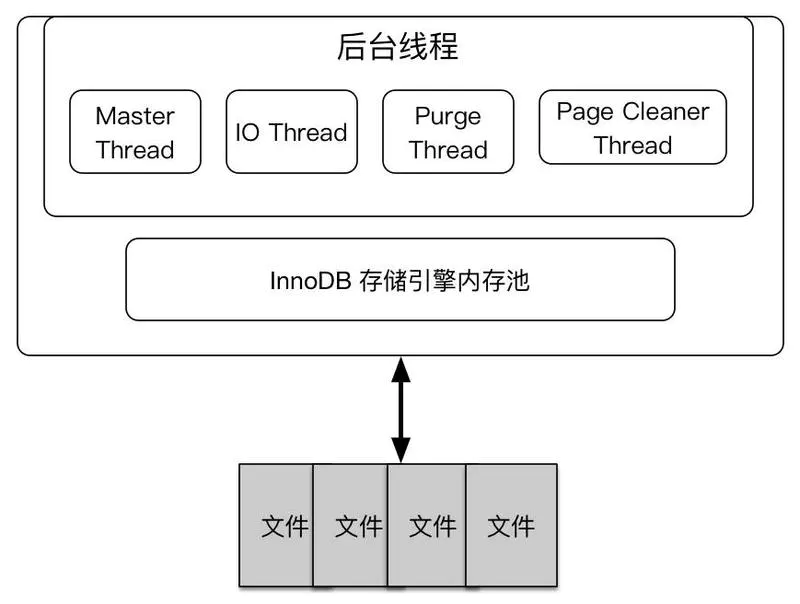
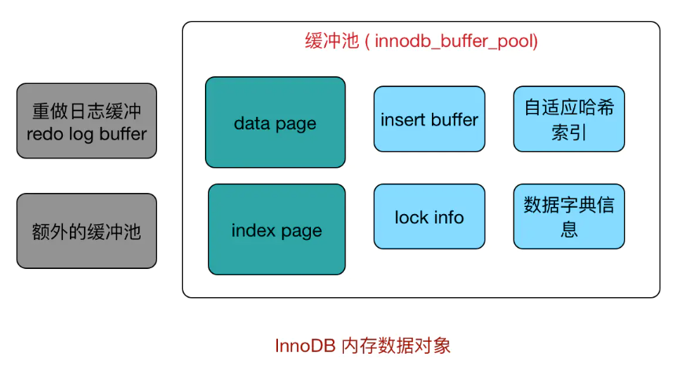
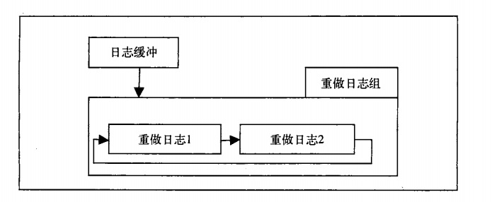
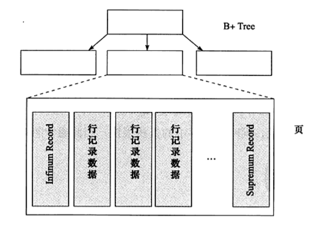
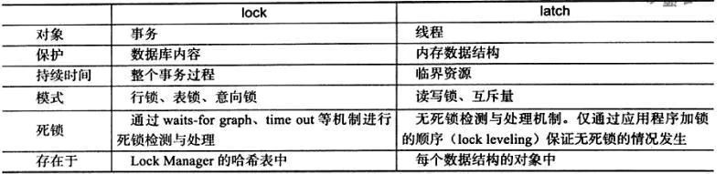
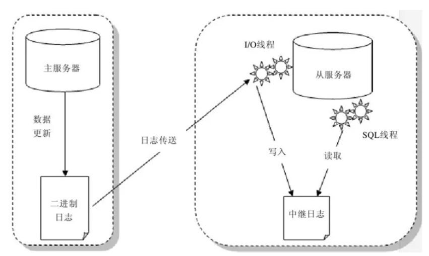

---

---

# MYSQL
## mysql基础
**mysql物理组件**：

1. 连接池组件
	
	> 管理缓冲用户连接，线程处理等需要缓存的需求
2. 管理服务和工具组件
3. SQL接口组件(SQL Interface)
	
	> 接受用户的SQL命令，并且返回用户需要查询的结果。比如select from就是调用SQL Interface
4. 查询分析器组件(Parser)
	> SQL命令传递到解析器的时候会被解析器验证和解析。解析器是由Lex和YACC实现的，是一个很长的脚本
	>
	> 将SQL语句分解成数据结构，并将这个结构传递到后续步骤，以后SQL语句的传递和处理就是基于这个结构的 
5. 优化器组件(Optimizer)
	
	> QL语句在查询之前会使用查询优化器对查询进行优化。他使用的是“选取-投影-联接”策略进行查询。用一个例子就可以理解： select uid,name fromuser where gender = 1;这个select 查询先根据where 语句进行选取，而不是先将表全部查询出来以后再进行gender过滤。这个select查询先根据uid和name进行属性投影，而不是将属性全部取出以后再进行过滤，将这两个查询条件联接起来生成最终查询结果
6. 缓冲组件(Cache和Buffer)
	
	> 如果查询缓存有命中的查询结果，查询语句就可以直接去查询缓存中取数据。这个缓存机制是由一系列小缓存组成的。比如表缓存，记录缓存，key缓存，权限缓存等
7. 插件式存储引擎
	> 根据mysql提供的api定义一种访问机制(存储引擎)
	>
	> **存储引擎基于表，而不是数据库**

**mysql连接方式**
实质是进程间的通信，有以下几种：

1. 管道
2. 命名管道
3. TCP/IP套接字
	
	> 通过TCP/IP连接到MySQL实例时，MySQL数据库会先检查一张权限视图，用来判断发起请求的客户端IP是否允许连接到MySQL实例。该视图在mysql架构下，表名为user.
4. UNIX域套接字

**InnoDB引擎**

- 特点：
	> - 事务安全引擎，常用于OLTP
    > - 可以将每个InnoDB存储引擎的表单独存放到一个独立的ibd文件中。 
	> - 支持用裸设备（row disk）来建立其表空间。 
	> - 通过多版本并发控制来获得高并发性。 
	> - 实现了SQL标准的4中隔离级别，默认为REPEATABLE级别。 
	> - 对表中数据的存储，采用了聚集的方式。因此，每张表的存储都是按照主键的顺序进行存放。如果没有显式的在表定义中指定主键，InnoDB存储引擎会为每一行生成一个6字节的ROWID，并以此作为主键。

**MyISAM引擎**

- 特点：
	
	>   - 不支持事务、表锁设计，支持全文索引，主要面向一些OLAP数据库应用。

## InnoDB引擎
**InnoDB结构**

内存池由多个内存块组成,这些内存块主要作用：
>   维护所有进程/线程需要访问的多个内部数据结构 
>缓存磁盘上的数据, 方便快速读取, 同时在对磁盘文件修改之前进行缓存 
>重做日志(redo log)缓冲

后台线程作用：
>   刷新内存池中数据，保证缓冲池中的内存缓存的是最新数据; 
>   将已修改数据文件刷新到磁盘文件; 
>   保证数据库发生异常时 InnoDB 能恢复到正常运行的状态

### 后台线程

1. Master Thread
	
	> 这是最核心的一个线程,主要负责将缓冲池中的数据异步刷新到磁盘,保证数据的一致性,包括赃页的刷新、合并插入缓冲、UNDO 页的回收等.
2. IO Thread
	> 在 InnoDB 存储引擎中大量使用了异步 IO 来处理写 IO 请求, IO Thread 的工作主要是负责这些 IO 请求的回调. 
	> `SHOW ENGINE INNODB STATUS\G`命令可以看到, InnoDB 共有10个 IO Thread, 分别是 4个 write、4个 read、1个 insert buffer和1个 log thread. 
	> 可以使用`innodb_read_io_threads`和`innodb_write_io_threads`参数进行设置
3. Purge Thread
	> 事物被提交之后, undo log 可能不再需要,因此需要 Purge Thread 来回收已经使用比分配的 undo页. InnoDB 支持多个 Purge Thread, 这样做可以加快 undo 页的回收 
	> InnoDB 引擎默认设置为4个 Purge Thread: 
	> SHOW VARIABLES LIKE "innodb_purge_threads"\G
4. Page cleaner Thread
	
	> 将之前版本中脏页的刷新操作都放入单独的线程中来完成,这样减轻了 Master Thread 的工作及对于用户查询线程的阻塞

### 内存

1. 缓冲池
	> InnoDB基于硬盘存储，缓冲池用内存来弥补硬盘和cpu之间的速度差距。 
	> 对数据库进行读取操作时，先检查缓冲池中是否有相同页，有直接返回，否则读取数据库，然后存一份在缓冲池中(称为FIX) 
	> 对数据库进行写操作时，先修改缓冲池中的页，然后通过CheckPoint机制刷新到硬盘，并不是每次缓冲池中发生页修改都直接刷新硬盘 
	> 缓冲池大小直接影响数据库性能，32位系统最大设置为3G，可以通过`innodb_buffer_pool_size`来设置 
	> 缓冲池中缓存的数据页类型有:索引页、数据页、 undo 页、插入缓冲、自适应哈希索引、 InnoDB 的锁信息、数据字典信息等.索引页和数据页占缓冲池的很大一部分 
	> 缓冲池实例可以有多个，以用户为单位，页根据hash值去分配到不同缓冲池，可以减少数据库内部资源竞争，增加数据库并发能力，可以通过`innodb_buffer_pool_instance`命令配置

	

2. LRU、Free List和Flush List
	> 缓冲池中存放着很多页，通过LRU算法管理，越常使用的页放队列前端，列表满了优先释放后端页。此外加入midpoint算法，**新加入的页存放在队列中的midpoint位置**，此位置可通过`innodb_old_blocks_pct`控制，默认存放在5/8处，此位置之前的部分称为热端new，后面称为old 
	> 使用midpoint主要是为了**防止大范围扫描插入大量新页从而导致热端页从列表中被刷掉**，这里还引进了`innodb_old_blocks_time`参数控制新页插入midpoint时等待多长时间后可以加入热端，当热端数据不止63%左右时可以适当延长这个的时间 
	> LRU列表存放脏页(有数据的页)，FREE LIST存放空页，分页时从free list获取页，存入LRU列表。否则根据LRU算法刷新LRU列表的页来存放新页，页从old状态变为new，这个动作称为page made young,因为`innodb_old_blocks_time`导致old变young失败称为 page not made young 
	> innodb支持压缩页功能，正常页大小16k，可以压缩为8k、4k、2k和1k，对于压缩后的页，LRU列表页地址也要更新，**利用伙伴算法调整页大小**(优先检查有没有同样大小的页，有直接用，没有拿一个大一级的页来分) 
	> LRU列表中存放具体脏页数据，FLUSH列表中存放脏页列表管理将页刷新回硬盘

3. 重做日志缓冲
	> 首先将重做日志信息存入重做日志缓冲，然后刷新到重做日志文件 
	>> Checkpoint每秒进行一次刷新 
	>> 提交一个事务时会进行一次刷新 
	>> 剩余空间小于1/2时会进行一次刷新 

### CheckPoint技术

数据库在发生增删查改操作的时候，都是先在buffer pool中完成的，为了提高事物操作的效率，buffer pool中修改之后的数据，并没有立即写入到磁盘，这有可能会导致内存中数据与磁盘中的数据产生不一致的情况。 
事物要求之一是持久性（Durability），buffer pool与磁盘数据的不一致性的情况下发生故障，可能会导致数据无法持久化。 
为了防止在内存中修改但尚未写入到磁盘的数据，在发生故障重启数据之后产生事物未持久化的情况，是通过日志(redo log)先行的方式来保证的。 
redo log可以在故障重启之后实现“重做”，保证了事物的持久化的特性，但是redo log空间不可能无限制扩大，对于内存中已修改但尚未提交到磁盘的数据，也即脏页，也需要写入磁盘。 
对于内存中的脏页，什么时候，什么情况下，将多少脏页写入磁盘，是由多方面因素决定的。
checkpoint的工作之一，就是对于内存中的脏页，在一定条件下将脏页刷新到磁盘。 

解决以下几个问题： 

1. 缩短数据库恢复时间
	
	> Checkpoint之前的数据已经成功写入硬盘，只用恢复本次重做日志缓冲即可
2. 缓冲池不够用，刷新脏页到磁盘
	
	> 根据LRU算法溢出的页如果是脏页则强制执行一次Checkpoint
3. 重做日志不可用时，刷新脏页

CheckPoint分类:

1. sharp checkpoint
	
	> 在关闭数据库的时候，将buffer pool中的脏页全部刷新到磁盘中
2. fuzzy checkpoint
	
	> 数据库正常运行时，在不同的时机，将部分脏页写入磁盘，进刷新部分脏页到磁盘，也是为了避免一次刷新全部的脏页造成的性能问题。

### Innodb关键特性

1. 插入缓冲
2. 两次写
	> 在对脏页刷新到磁盘时，如果某一页还没写完就宕机，此时该页数据已经混乱无法通过redo实现恢复。innodb提供了doublewrite机制，其刷新脏页步骤如下：
	>
	> 1. 先将脏页数据复制到doublewrite buffer中（2MB内存）
	> 2. 将doublewrite buffer分两次，每次1MB写入到doublewrite磁盘（2MB）中。
	> 3. 马上同步脏页数据到磁盘。对于数据混乱的页则可以从doublewrite中读取到，该页写到共享表空间。
3. 自适应哈希索引
	> InnoDB存储引擎会监控对表上索引的查找，如果观察到建立哈希索引可以带来速度的提升，则建立哈希索引，所以称之为自适应（adaptive） 的。 
	> 自适应哈希索引通过缓冲池的B+树构造而来，因此建立的速度很快。而且不需要将整个表都建哈希索引，InnoDB存储引擎会自动根据访问的频率和模式 来为某些页建立哈希索引。
4. 异步IO
	
	> linux和windows中提供异步IO，其可以对连续的页做合并连续页的IO操作使随机IO变顺序IO。
5. 刷新领近页
	> 刷新页时判断相邻页是否也是脏页。

	> 传统机械键盘建议启用，固态硬盘不建议启用
6. 启动和恢复

## 第三章 文件
### 参数文件
当MySQL实例启动时，MySQL会先去读一个配置参数文件，用来寻找数据库的各种文件所在位置以及指定某些初始化参数，这些参数通常定义了某种内存结构有多大等设置。 
分为静态参数和动态参数两种

### 日志文件

1. 错误日志
	> 记录启动、运行或停止mysqld时出现的问题,该文件不仅记录了所有的错误信息，也记录了一些警告信息或正确的信息。
	> 
	> 定位命令`SHOW VARIABLES LIKE 'log_error'`
2. 二进制日志
	> 二进制日志（binary log）记录了对MySQL数据库执行更改的所有操作,包含关于每个更新数据库的语句的执行时间信息,默认未开启，开启后性能下降1%。 
	> 尽可能将数据库恢复到事故故障点，因为二进制日志包含备份后进行的所有更新;用于在主复制服务器上记录所有将发生送给从服务器的语句. 
	> 查看是否启用二进制日志：`show variables like '%log_bin%';` 
3. 慢查询日志
	> 记录所有执行时间超过`long_query_time`秒的所有查询或不使用索引的查询. 
	> 默认情况下，MySQL不开启慢查询日志，`long_query_time`的默认值为10，即运行时间超过10s的语句是慢查询语句。 
	> 
	> 查看当前慢查询日志的开启情况:`show variables like '%query%';` 
	> 查询当前慢查询的语句个数:`show global status like '%slow%';` 
	> 可以通过查询语句查看慢查询的语句：`select * from mysql.slow_log;` 
4. 查询日志
	> 查询日志记录了所有对MySQL数据库请求的信息，无论这些请求是否得到了正确的执行。默认文件名为:主机名.log 
> ### socket文件
> 一般在/tmp目录下，名为mysql.sock.
> ### pid文件
> 实例的进程文件,默认位于数据库目录下，文件名为主机名.pid
> ### Mysql表结构文件
> 每个表或视图，都有一个以frm为后缀名的文本文件，记录该表的表结构定义。
>
	> ### InnoDB存储索引文件
1. 表空间文件
	
	> InnoDB将数据按照表空间进行存放，可以设置多个表空间做负载均衡
2. 重做日志文件
	> **记录了对于InnoDB存储引擎的事务日志**，例如，数据库由于所在主机掉电导致实例失败，InnoDB存储引擎会使用重做日志恢复到掉电前的时刻，以此来保证数据的完整性。 
	> 每个InnoDB存储引擎至少有1个重做日志文件组，每个文件组下至少有2个重做日志文件，如默认的ib_logfile0和ib_logfile1。InnoDB存储引擎先写重做日志文件1，当达到文件的最后时，会切换至重做日志文件2，当重做日志文件2也被写满时，会再被切换到重做日志文件1中。 
	 

## 第四章 表
### 索引组织表
根据主键顺序进行物理存放的表称为**索引组织表**
InnoDB表中都有主键，如果创建表的时候没有声明主键，则根据以下优先顺序生成主键： 

1. 首先判断表中是否存在非空的唯一索引（**Unique NOT NULL**），如果有，则该列即为主键。在创建的的过程中，如果表中，有多个非空唯一索引的时候，则按照创建索引的顺序，以第一个非空唯一索引为准来创建。
2. 不符合上述条件则会自动生成一个UUID格式的隐藏式主键（大小为6字节）

通过_rowid可以显示表的主键，但是只能查看单个列作为主键的情况，对于多列组成的主键则不可以。

### InnoDB逻辑存储结构
表空间结构： 
表空间->段->区->页

#### 表空间
所有数据信息都存放在表空间当中，默认情况下InnoDB存储引擎有一个共享表空间ibdata1,即所有数据都存放在这个表空间内。如果用户启动了`innodb_file_per_table`，则每个表内的数据可以单独放到一个表空间内，但要注意的是每张表的表空间内存放的只是数据、索引和插入缓存Bitmap页，而其他类的数据，如回滚(undo)信息，插入缓存索引页、系统事务信息、二次写缓存（Double write buffer）等还是存放在原来的共享表空间内。
即使设置了innodb_file_per_table为ON了，共享表空间还是会不断地增加其大小。

#### 段
表空间由各个段组成，比如数据段，索引段，回滚段等。InnoDB数据即索引，索引即数据，数据段是B+树的叶子节点，索引段是B+树的非索引节点。

#### 区
**区由连续的页组成，大小固定为1MB**，InnoDB存储引擎一次从磁盘申请大概4-5个区。在默认情况下，**页的大小为16KB，即一个区中有大概64个连续的页**，引入压缩页后页大小变为2K、4K，每个区页数量也随之变化。

#### 页
页是InnoDB磁盘管理最小单位，默认大小16K 

- **B树节点= 一个物理Page（16K）**
- 数据按16KB切片为Page并编号
- 编号可映射到物理文件偏移(16K * N）
- B+树叶子节点前后形成双向链表

#### 行
**每页最多存放(16K/2)-200行数据，也就是7992行数据**

### InnoDB记录行格式
页内数据以一行行的形式保存，主要分为两种：

- Compact行记录格式
- RedunDant行记录格式

#### Compact行记录格式
如果一页中存放更过行数据，性能越牛皮。

|变长字段长度列表|NULL标志位|记录头信息|RowID(6字节，自动创建)|TransactionID(事务ID)|Roll Pointer|列1数据|列2数据|

其中如果列数据类型为CHAR定长字段未使用空间用`0X20`填充，记录头信息字段最后两个字节存储了下一个记录的偏移量，意味着在InnoDB页内部记录通过链表结构进行串联。

#### Redundant行记录格式
这个比较古老不记录了

#### 行溢出数据
InnoDB存储引擎可以将一条记录中的某些数据存储在真正的数据页面之外，即作为行溢出数据。般认为BLOB、LOB这类的大对象列类型的存储会把数据存放在数据页面之外。但是，这个理解有点偏差，BLOB可以不将数据放在溢出页面，而即使是varchar列数据类型，依然有可能存放为行溢出数据。

MySQL数据库的varchar字段，它可以存放65536字节的数据，比oracle和sqlserver大多了，但是在使用varchar时也有几点要注意；

- 65536只是这么说，要建表的时候指定一个字段65536仍然会报错，因为字段本身还有其他开销，实际只能存放65532字节。
- 65532字节并不是每个varchar字段都可以设置的，他是一个总和，也就是说如果有2个varchar字段的表，那么每个varchar字段只能设置65532/2的值。
- 建表时要注意编码格式哦，varchar(65532)代表的是字节数，如果使用GBK或者UTF-8那就无法建立成功了，因为GBK一个字符占用2字节，UTF-8一个字符占用3字节。

页（PAGE）是innoDB存储引擎的最小存储单位，默认大小为16KB，及16384字节，行数据存储在页中；那么一行数据如果超过了一个页能够存储的大小怎么办？比如上面说的varchar(65532)，65532字节该如何存储？这个时候就会发生行溢出。

一般情况下InnoDB存储引擎数据存放在也类型为B-tree node中，发生行溢出时数据存放在页类型为Uncompress BLOB页中。多长的VARCHAR保存在单个数据页中，多长的会触发溢出保存在BLOB页中？ 

	> 因为InnoDB引擎采用B+树结构，一页得存放两个以上数据才有意义，如果只能存放一行数据则会触发溢出。这个长度阈值为8098.

#### Compressed和Dynamic行记录格式
新版本引入的行记录格式，特点是存放在BLOB中的数据直接采取行溢出操作，页内只存20字节的指针，实际的数据都存放在BLOB Page中，而之前的Compact和Redundant两种格式会存放768个前缀字节。 
存储在其中的行数据会以zlib的算法进行压缩，因此对于BLOB、TEXT、VARCHAR这类大长度类型的数据能进行非常有效的存储

#### CHAR类型存储
在多字节字符集下，CHAR类型和CHARVAR类型没区别都是变长，对于未能占满长度的字符还是填充长度。

### InnoDB数据页结构

一个数据页主要组成结构：

- File header（文件头）
	- 一些头部信息，包括记录当前页的上下页（B+树特性，页之间是双向链表结构）
- Page Header（页头）
	- 数据页状态，包括页记录数信息，索引id和最后插入记录位置之类
- Infimun+Supremum Records
	- 虚拟记录，用来限定页记录边界，这两个值在页创建时被建立，并且在任何情况下不会被删除。
	- 
- User Records（用户记录，即行记录）
	- User Records即实际存储行记录的内容。再次强调，InnoDB存储引擎表总是B+树索引组织的。
- Free Space（空闲空间）
	- Free Space指的就是空闲空间，同样也是个链表数据结构。当一条记录被删除后，该空间会被加入空闲链表中。
- Page Directory（页目录）
	- Page Directory（页目录）中存放了记录的相对位置。需要记住，**B+树索引本身并不能找到具体的一条记录，B+树索引能找到的只是该记录所在的页。数据库把页载入内存，然后通过Page Directory再进行二分查找**。
- File Trailer（文件结尾信息）
	- 用来保证页能够完整的写入磁盘，来作比较以此来保证页的完整性。

### 约束
完整性是指数据的准确性和一致性，而完整性检查就是指检查数据的准确性和一致性。mysql数据库管理系统提供了一直机制来检查数据库中的数据是否满足规定的条件。以保证数据库中数据的准确性和一致性，这种机制就是约束。

mysql中约束类型：

- NOT NULL(NK)
- UNIQUE KEY(UK)约束字段的值是唯一的
- PRIMATYKEY(PK)
- AUTO_INCREMENT
- FOREIGN KEY(FK)

索引是从数据结构的角度来保证数据完整性, 而约束是一个逻辑概念,用来保证数据完整性.

#### 保证数据完整性方法

1. 约束错误数据
	- 设置sql_mode 为 严格模式, 来提示报错而不是警告
	- 对字段已设置为not null , 插入了 非法日期的值: 比如 2009-02-30.
2. ENUM 和 SET 约束(针对数据类型).
	- 比如假设 性别 只允许两种, male, female. enum('male', 'female'), 也可以 enum(0, 1). 如果设置为 tinyint(1), 值就可以存在 0-9.
3. 触发器约束
	- 通过创建触发器来过滤错误的数据.一般用在字读间的计算.
	- 比如当金额逻辑正常只会增加，用户非法输入负数，导致金额相加总额变小
4. 外键
	- 保护策略有4种：
		- `CASCADE`
			- 主表delete和update,子表同delete和update。
		- `SET NULL`
			- 主表delete和update,子表对应列为`NULL`
		- `NO ACTION`
			- 啥都不错
		- `RESTRICT`
			- 主表delete和update,子表报错

### 视图

视图的主要用途之一是被用作一个抽象装置，特别是对于一些应用程序，程序本身不需要关心基表的结构，只需要按照视图定义来获取数据或者更新数据。因此，视图同时在一定程度上起到一个安全层的作用。
Mysql本身不支持物化视图，需要采用SELECT然后INSERT类似这种的方式导入视图的数据到表中。

### 分区表
将一个表或者索引分为多个，对外界访问数据库逻辑透明依旧只有一个表或者索引，实际物理上有多个。 
mysql只支持水平分区，只支持局部分区索引（分区中包含索引和数据），不支持全局（分区中只包含数据）。 

#### 分区类型
表中有主键或者唯一索引时，分区列必须是索引的其中一个组成部分

mysql支持分局类型：

- RANGE分区
	- 基于属于一个给定连续区间的列值，把多行分配给分区
- LIST分区
	- 类似于按RANGE分区，区别在于LIST分区是基于列值匹配一个离散值集合中的某个值来进行选择
- HASH分区
	- 基于用户定义的表达式的返回值来进行选择的分区，该表达式使用将要插入到表中的这些行的列值进行计算。
	- HASH分区主要用来确保数据在预先确定数目的分区中平均分布。在RANGE和LIST分区中，必须明确指定一个给定的列值或列值集合应该保存在哪个分区中。
	- 在HASH分区中，MySQL 自动完成这些工作，你所要做的只是基于将要被哈希的列值指定一个列值或表达式，以及指定被分区的表将要被分割成的分区数量。
- KEY分区
	- 类似于按HASH分区，区别在于KEY分区只支持计算一列或多列，且MySQL服务器提供其自身的哈希函数。必须有一列或多列包含整数值。

#### 子分区
也叫复核分区，也就是在已经分区的基础上再分区，仅适用于在RANGE和LIST分区基础上进行HASH和KEY分区

#### 分区中的NULL值
mysql中将NULL视为比任何非NULL值都小的值 

向分区列插入NULL值：

- RANGE：
	
	> 将值放入最左边分区
- LIST：
	
	> 必须在建表创建分区时声明哪个分区可以存放NULL
- HASH和KEY：
	
	> 任何分区函数都会将NULL值返回0

#### 分区好处
mysql数据库中的数据是以文件的形势存在磁盘上的，默认放在/mysql/data下面（可以通过my.cnf中的datadir来查看），
一张表主要对应着三个文件，一个是frm存放表结构的，一个是myd存放表数据的，一个是myi存表索引的。

如果一张表的数据量太大的话，那么myd,myi就会变的很大，查找数据就会变的很慢，这个时候我们可以利用mysql的分区功能，在物理上将这一张表对应的三个文件，分割成许多个小块，这样呢，我们查找一条数据时，就不用全部查找了，只要知道这条数据在哪一块，然后在那一块找就行了。如果表的数据太大，可能一个磁盘放不下，这个时候，我们可以把数据分配到不同的磁盘里面去。、

当表非常大，或者表中有大量的历史记录，而“热数据”却位于表的末尾。如日志系统、新闻。。此时就可以考虑分区表。【注：此处也可以使用分表，但是会增加业务的复杂性。】

优点：

- 与单个磁盘或文件系统分区相比，可以存储更多的数据。
- 对于那些已经失去保存意义的数据，通常可以通过删除与那些数据有关的分区，很容易地删除那些数据。
- 一些查询可以得到极大的优化。 可以把一些归类的数据放在一个分区中，可以减少服务器检查数据的数量加快查询。
- 涉及到例如SUM()和COUNT()这样聚合函数的查询，可以很容易地进行并行处理。
- 通过跨多个磁盘来分散数据查询，来获得更大的查询吞吐量。

#### 什么时候可以进行分区

1. 当数据量很大(过T)时，肯定不能把数据再如到内存中，这样查询一个或一定范围的item是很耗时。另外一般这情况下，历史数据或不常访问的数据占很大部分，最新或热点数据占的比例不是很大。这时可以根据有些条件进行表分区。
2. 分区表的更易管理，比如删除过去某一时间的历史数据，直接执行truncate，或者狠点drop整个分区，这比detele删除效率更高
3. 当数据量很大，或者将来很大的，但单块磁盘的容量不够，或者想提升IO效率的时候，可以把没分区中的子分区挂载到不同的磁盘上。
4. 使用分区表可避免某些特殊的瓶颈，例如**Innodb的单个索引的互斥访问**..
5. 单个分区表的备份很恢复会更有效率，在某些场景下

总结：可伸缩性，可管理性，提高数据库查询效率。

例如：

- 项目中需要动态新建、删除分区。如新闻表，按照时间维度中的月份对其分区，为了防止新闻表过大，只保留最近6个月的分区，同时预建后面3个月的分区，这个删除、预建分区的过程就是分区表的动态管理。

注意注意，分区可能会有坏处，例如：

- 如果表内1000W条数据，查询需要过两层B+树，分10个区，每个区100W条，查询也是两层B+树，都是两次IO，没提升
- 如果查询条件为非分区列查询，那么需要遍历所有分区，则是2*10次IO，很蠢

## 第五章 索引与算法

### 数据结构与算法

1. 二分查找
2. 二叉树
3. 平衡二叉树
	
	> 让查找效率更加平衡，左右子树高度最大差1，引入平衡二叉树
4. B树
5. B+树

### B+树索引
可以分为聚集索引和辅助索引，区别为聚集索引存放的是一整行数据

1. 聚集索引
	> 在同一个结构中保存了B-Tree索引和数据行 
	> InnoDB只能通过主键聚集索引！ 
	> MySQL中每个表都有一个聚簇索引，除此之外的表上的每个非聚簇索引都是二级索引，又叫辅助索引 
	> 按照每张表的主键构建B+树，叶子节点中存放完整数据。**每张表只有一棵B+树，所以也只能有一个聚集索引** 
	> 聚集索引不按照物理地址存储数据，只是页（叶子节点）之间通过链表链接通过主键排序，页中的记录也通过链表维护 
	> 能在叶子节点上直接找到数据 
	> 方便范围查询 
	- 缺点：
		> 聚簇索引最大限度**提高了I/O密集型应用的性能**，但如果数据全部都放在内存中，则访问的顺序就没有那么重要了，聚簇索引也就没什么优势了。 
		> 插入速度严重依赖插入顺序。按照主键的顺序插入式加载数据到InnoDB表中速度最快的方式。但如果不是按照主键顺序加载数据，那么在加载完成后最好使用OPTIMIZE TABLE命令重新组织一下表。 
		> 更新聚簇索引列的代价很高，因为会强制InnoDB将每个被更新的行移动到新的位置。 
		> 基于聚簇索引的表在插入新行，或者主键被更新导致移动行的时候，可能面临叶分裂的问题。 
		> **二级索引访问需要两次索引查找，而不是一次**。 
2. 辅助索引

### 索引使用

1. 联合索引（a,b）
	> 好处 
	>> 当语句为`select * from table where a=* and b=*`和`select * from table where a=* order by b`可以直接获取结果 
	>> 键值a和b都按照相对增长序列排序
2. 覆盖索引
	> 如果一个索引包含（或者说覆盖）所有需要查询的字段的值，就可以使用索引来直接获取列的数据，这样就不再需要读取数据行。我们称这样的索引为覆盖索引。 
	> 例如，表inventory有一个多列索引（store_id, film_id），MySQL如果只需要访问这两列，就可以使用这个索引做覆盖索引，如SELECT store_id, film_id FROM inventory.

用户可以提示控制器使用哪个索引（仅提示），也可以强制控制器使用某个索引

### HASH算法

哈希索引基于哈希表实现，只有精确匹配索引所有列的查询才有效。对于每一行数据，存储引擎都会对所有的列计算一个哈希码，哈希索引将所有的哈希码存储在索引中，同时保持指向数据行的指针。

- 哈希索引数据并不是按照索引数据顺序存储的，所以无法用于排序
- 哈希索引页不支持部分索引列匹配查找，因为哈希索引始终是使用索引列的全部内容来计算哈希值的
- 哈希索引只支持等值比较查询，不支持任何范围查询
- InnoDB引擎有个特殊的功能叫做“**自适应哈希索引**”。当InnoDB注意到某些索引值被使用得非常频繁时，它会在内存中基于B-Tree索引之上再创建一个哈希索引。这是一个完全自动的、内部的行为。

### 全文检索
全文索引是将存储于数据库中的整本书或整篇文章中任意内容信息查找出来的技术
#### 倒排索引
全文索引通常用倒排索引来实现，倒排索引和BTree一样，是一种索引结构，它在辅助表中存储了单词与单词自身在一个或多个文档中所在位置之间的映射，其拥有两种表现形式：
#### InnoDB全文检索
InnoDB全文检索采用full inverted index方式，并将（DocumentId，Position）视为一个“ilist”，因此在全文检索表中有两个列：word字段和ilist字段。为了提高检索性能，InnoDB中共有6张辅助表。

#### 全文检索

## 锁

InnoDB采用行锁设计，有两种锁类型：

- latch：一般称为闩锁(轻量级的锁) 因为其要求锁定的时间非常短，若迟勋时间长，则应用性能非常差，在InnoDB存储引擎中，latch有可以分为mutex(互斥锁)和rwlock(读写锁)其目的用来保证并发线程操作临界资源的正确性，并且没有死锁检测的机制
- lock：对象是事务，用来锁定的是数据库中的UI想，如表、页、行。并且一般lock对象仅在事务commit或rollback后进行释放(不同事务隔离级别释放的时间可能不同)，此外lock正如大多数数据库中一样，是有死锁机制的。
- 

根据级别可以分为三种锁：

- 表级锁：开销小，加锁快；不会出现死锁；锁定粒度大，发生锁冲突的概率最高，并发度最低。
- 行级锁：开销大，加锁慢；会出现死锁；锁定粒度最小，发生锁冲突的概率最低，并发度也最高。
	- 共享锁（S Lock），允许事务读一行数据；
	- 排它锁（X Lock），允许事务删除或更新一行数据。
	- 对于一行数据只能同时允许多个线程拥有共享锁；
	- 排它锁同时只能一个进程拥有，且同时不能有其他共享锁
- 页面锁：开销和加锁时间界于表锁和行锁之间；会出现死锁；锁定粒度界于表锁和行锁之间，并发度一般

InnoDB支持多粒度锁实现，这种锁允许事务在行级上的锁和表级上的锁同时存在。实现方式如意向锁（根据表、行不同层次进行加锁），如果需要对记录r上X锁，那么分别需要对数据库A、表、页上意向锁IX，最后对记录r上X锁。若其中任何一个步骤导致等待，那么该操作需要等待粗粒度锁的完成。举例来说，在对记录r加X锁之前，已经有事务对表1进行了S锁，而当前事务需要对表1上IX锁，由于不兼容，所以该事务需要等待表锁操作的完成。

#### 一致性非锁定读

通过**多版本控制**（undo中记录的当前行历史版本快照）方式来读取数据。 
如果读取的行正在执行DELETE或UPDATE操作，这是读取操作不会因此去等待行上锁的释放。相反的，InnoDB存储引擎会去读取行的一个快照数据。

undo用来在事务中回滚数据，因此快照数据本身是没有额外的开销。非锁定读机制极大地提高了数据库的并发性。InnoDB存储引擎默认的读取方式，即读取不会占用和等待表上的锁。

在READ COMMITTED事务隔离级别下，对于快照数据，一致性非锁定读总是读取被锁定行的最新一份快照数据（违反了事务ACID中的I的特性，即隔离性）。而在REPEATABLE READ事务隔离级别下，一致性非锁定读总是读取事务开始时的行数据版本。

#### 一致性锁定读

mysql默认用非锁定读模式，可以显式的对数据库读取操作进行加锁以保证数据逻辑的一致性。select方式有两种：

- SELECT ... FOR UPDATE（X锁）
- SELECT ... LOCK IN SHARE MODE（S锁）

#### 自增长和锁

InnoDB内部用一个计数器，实现锁不在事务完成后才释放，而是在完成对自增长值SQL语句插入后就立即释放。

#### 外键和锁

当对一个外键进行操作时，如果外键父表在这之前删除了外键这条对应记录没提交会导致父子表记录不一致出现问题。在InnoDB存储引擎中，对于一个外键列，如果没有显示地对这个列加索引，InnoDB存储引擎会自动对其加一个索引，因为这样可以避免表锁。

### 锁的算法

1. `Record Lock`：单个行记录上的锁
2. `Gap Lock`：间隙锁，锁定一个范围，但不包含记录本身
3. `Next-Key Lock`：`Gap Lock` + `Record Lock`，锁定一个范围，并且锁定记录本身

InnoDB对于行的查询都是采用这种Next-Key Lock锁定算法。但查询的索引含有唯一属性时，InnoDB存储引擎会对Next-Key Lock进行优化，将其降级为Record Lock，即仅锁住记录本身，而不是范围。如SELECT * FROM t WHERE pk = 5 FOR UPDATE；

如下SQL语句：SELECT * FROM t WHERE pk > 2 FOR UPDATE，第一次返回a=5这条记录；若这时另一个事务插入了4这个值，那么第二次执行时将返回4和5.这与第一次得到的结果不同，违反了事务的隔离性，即当前事务能够看到其他事务的结果。InnoDB默认采用`Next-Key Lock`解决Phantom Problem（幻读，在同一事务下，连续两次执行相同的SQL语句可能会导致不同的结果，第二次的SQL语句可能会返回之前不存在的行（重点在记录数不一样））问题。对于上述SQL语句，其锁住的不是5这个单值，而是对(2, +∞)这个范围加了X锁。因此任何对于这个范围的插入都是不被允许的，从而避免Phantom Problem。

### 锁问题

1. 脏读
	- 所谓脏数据是指事务对缓冲池中行记录的修改，并且还没有被提交。
	- 脏读指的就是在不同的事务下，当前事务可以读到另外事务未提交的数据，简单来说就是可以读到脏数据。
	- 脏读在生产环境中并不常见。脏读发生的条件是需要事务的隔离级别为READ UNCOMMITTED，而目前绝大多数的数据库都至少设置成READ COMMITTED。
2. 不可重复读
	- 在一个事务内多次读取同一数据集合。在这个事务还没有结束时，另外一个事务也访问该数据集合，并做了一些DML操作。这样，由于第二个事务的修改，第一个事务两次读到的数据可能是不一样的，这种情况称为不可重复读。
	- 不可重复读和脏读的区别是：**脏读是读到未提交的数据，而不可重复读读到的却是已经提交的数据**。
	- 一般来说，不可重复读的问题是可接受的，因为其读到的数据是已经提交的，本身不会带来很大的问题。因此，很多数据库厂商，如Oracle、Microsoft SQL Server将其数据库事务的默认隔离级别设置为READ COMMITTED，在这种隔离级别下允许不可重复读的现象。
3. 幻读
	- 一个事务按相同的查询条件查询之前检索过的数据，确发现检索出来的结果集条数变多或者减少（由其他事务插入、删除的），类似产生幻觉。
4. 更新丢失
	- 两个事务同时对某条记录进行修改，后者操作覆盖前者导致前者操作丢失。目前的隔离级别基本不会发生这种情况
	- 如两个用户同时进行查询页面展示，前者进行操作后，后者页面未刷新，后者又进行操作

### 阻塞和死锁

1. 阻塞
	
	> 第一个连接占有资源没有释放，而第二个连接需要获取这个资源。如果第一个连接没有提交或者回滚，第二个连接会一直等待下去，直到第一个连接释放该资源为止。对于阻塞，数据库无法处理，所以对数据库操作要及时地提交或
2. 死锁
	> 是指两个或两个以上的事务在执行过程中，因争夺资源而造成的一种互相等待的现象。若无外力作用，事务都将无法推进下去，解决死锁的最简单问题是不要有等待，任何的等待都转换为回滚，并且事务重新开始，但在线上环境，这可能会导致并发性能下降，甚至任何一个事务都不能进行，而这所带来的问题远比死锁的问题更严重 
	> 解决死锁的办法：
	> 
	> - 超时回滚
	> - 等待图（wait-for graph）

## 第七章 事务

事务的ACID特性：

1. 原子性
	
	> 原子性指整个数据库事务是不可分割的工作单位。事务中的所有数据库操作要么全部成功，要么全部撤销。
2. 一致性
	
	> 一致性指事务将数据库从一种一致的状态转变为下一种一致的状态。在事务开始之前和结束之后，数据库的完整性约束没有破坏。
3. 隔离性
	
	> 事务的隔离性要求，事务提交前对其他事务不可见。通常这使用锁来实现。
4. 持久性
	
	> 事务一旦提交，其结果就是永久性的。即使发生宕机等事故，数据库也能将数据恢复。

### 事务实现

事务隔离性由锁来实现。 
原子性、一致性、持久性通过数据库的redo log和undo log来完成。**redo log称为重做日志，用来保证事务的原子性和持久性。undo log用来保证事务的一致性**。

redo和undo都可以视为一种恢复操作，redo恢复提交事务修改的页操作，而undo回滚行记录到某个特定版本(指的是逻辑上rollback事务操作，当有多个事务并行时并不会恢复到rollback事务之前版本)。因此两者记录的内容不同，**redo通常是物理日志，记录的是页的物理修改操作。undo是逻辑日志，根据每行记录进行记录**。

#### redo

重做日志用来实现事务的持久性（所以关于上面原子性的实现，有待商榷）。其由两部分组成：一是内存中的重做日志缓冲，其是易失的；二是重做日志文件，其是持久的。InnoDB是事务的存储引擎，其通过Force Log at Commit机制实现事务的持久性，即当事务提交时，必须先将该事务的所有日志写入到重做日志文件进行持久化。

为了确保每次日志都写入重做日志文件，在每次将重做日志缓冲写入重做日志文件后，为了确保日志写入磁盘（因为这里有一个文件系统缓存），必须进行一次fsync操作。由于fsync的效率取决于磁盘的性能，因此磁盘的性能决定了事务提交的性能，也就是数据库的性能。

InnoDB存储引擎允许用户手工设置非持久性的情况发生，以此提高数据库的性能。即当事务提交时，日志不写入重做日志文件，而是等待一个时间周期后再执行fsync操作。这可以显著提高数据库的性能，但是当数据库发生宕机时，由于部分日志文件未写入磁盘，因此会丢失最后一段时间的事务。

#### LSN
Log Sequence Number的缩写，其代表的是日志序列号,表示事务写入重做日志的字节总量。例如，当前重做日志的LSN是1000，事务T1写入了100字节的重做日志，LSN就变成1100，又有事务T2写入200字节的重做日志，那么LSN变成：1300。

每个页的头部也有一个LSN，记录的是该页最后刷新时LSN的大小。重做日志记录的是每个页的物理更改日志，因此页中的LSN用来判断是否需要进行恢复操作。例如：页的LSN为10000，数据库启动时，写入重做日志的LSN为13000，表明该事务已经提交，数据库需要恢复；重做日志中的LSN小于页中的LSN，不需要进行重做，因为页中的LSN表示已经刷新到该位置。

InnoDB存储引擎在启动时不管上次数据库运行时是否正常关闭，都会尝试进行恢复操作。

#### undo

重做日志记录了事务的行为，可以很好的通过其对页进行“重做”操作。但是事务有时还需要进行回滚操作，这时就需要undo。如果用户执行的事务或语句由于某种原因失败了，又或者用户用一条ROLLBACK语句请求回滚，就可以利用这些undo信息将数据回滚到修改之前的样子。

除了回滚操作，undo的另一个作用是MVCC，即在**InnoDB存储引擎中MVCC的实现是通过undo来完成**。当用户读取一行记录时，若该记录已经被其他事务占用，当前事务可以通过读取之前的行版本信息，以此实现非锁定读。

最后也是最为重要的一点是，**undo log也会产生redo log**，也就是undo log的产生会伴随着redo log的产生，这是因为undo log也需要持久性的保护。

#### purge

purge用于最终完成delete和update操作。这样设计是因为InnoDB存储引擎支持MVCC，所以记录不能在事务提交时立即进行处理。这时其他事务可能正在引用该行，故InnoDB存储引擎需要保存记录之前的版本。而是否可以删除该条记录通过purge来进行判断。若该行记录已不被任何其他事务引用，那么就可以进行真正的delete操作。

#### group commit

**若事务为非只读事务，则每次事务提交时需要进行一次fsync操作**，以此保证重做日志都已经写入了磁盘。然而磁盘的fsync性能是有限的，为了提高效率，当前数据库都提供了group commit功能，即**一次fsync可以刷新确保多个事务日志被写入文件**。

### 事务隔离级别

- READ UNCOMMITEED
	
	> 读不可提交，在另一个事务没有提交的情况下，也能读取，可能会出现脏读情况
- READ COMMITTED
	
	> 不可重复读，在事务还未提交的情况下，另一事务改变一个数据并提交后，本事务在未提交的情况下能读取变更后的数据。这种情况就是幻读。所以该种隔离级别会出现幻读现象。
- REPEATABLE READ
	
	> 可重复读，可避免脏读以及幻读(使用Next-Key Lock算法)现象，在本事务未提交的情况下不会读到不同的数据。
- SERIALIZATION
	> 序列化，没有并发，虽能避免脏读、幻读等情况，但性能较低
	> select语句会加一个共享锁，所以不支持一致性非锁定读

### 分布式事务

XA事务指允许多个独立的事务资源参与到一个全局事务中，使用全局事务时隔离级别必须设置为SERIALIZATION

内部XA事务指存储引擎与插件之间，比如复制过程中先写二进制文件，再写InnoDB重做日志，这个过程要保证原子性。

### 不好的事务习惯

1. 不要在循环中提交事务
	- 因为每次提交事务都要写一次重做日志
2. 尽量不要使用自动提交
3. 尽量不要使用自动回滚

## 第八章 备份与恢复
### 备份类型
根据备份的方法不同：

- Hot Backup（热备）：在数据库运行中直接备份
- Cold Backup（冷备）：在数据库停止的情况下备份
- Warm Backup（温备）：同样是在数据库运行中进行，但会对当前数据库的操作有所影响，如加一个全局读锁以保证备份数据的一致性

根据备份后文件的内容：

- 逻辑备份
	-  备份出的文件内容是可读的，一般是文本文件，内容一般是由一条条SQL语句，或者是表内实际数据组成。这类方法的好处是可以观察导出的文件的内容，一般适用于数据库的升级、迁移等工作。但其缺点是恢复所需要的时间往往较长。
- 裸文件备份
	- 复制数据库的物理文件。这类备份的恢复时间往往较逻辑备份短很多。

按照备份数据库的内容来分：

- 完全备份：对数据库进行一个完整的备份
- 增量备份：在上次完全备份的基础上，对于更改的数据进行备份
- 日志备份：对MySQL数据库二进制日志的备份，通过对一个完全备份进行二进制日志的重做来完成数据库的point-in-time的恢复工作。

MySQL数据库复制（replication）的原理就是异步实时地将二进制日志传送并应用到从（slave/standby）数据库。但是对于真正的增量备份来说，只需要记录当前每页最后的检查点的LSN，如果大于之前全备时的LSN，则备份该页，否则不用备份，这大大加快了备份的速度和恢复的时间。

### 快照备份
通过写时复制技术来创建快照。当创建一个快照时，仅复制原始卷中数据的元数据，并不会有数据的物理操作，因此快照的创建过程是非常快的。当快照创建完成，原始卷上有写操作时，快照会跟踪原始卷块的改变，将要改变的数据在改变之前复制到快照预留的空间里，因此这个原理的实现叫做写时复制。而对于快照的读取操作，如果读取的数据块是创建快照后没有修改过的，那么会将读操作直接重定向到原始卷上；如果要读取的是已经修改过的块，则将读取保存在快照中该块在修改之前的数据。因此，采用写时复制机制保证了读取快照时得到的数据与快照创建时一致。

### 复制

复制步骤：

1. 主服务器（master）将数据更改记录到二进制日志中
2. 从服务器（slave）把主服务器的二进制日志复制到自己的中继日志（relay log）中。
3. 从服务器重做中继日志的日志，把更改应用到自己的数据库上，以达到数据的最终一致性。

复制采取异步实时方式，不是实时同步，存在主从服务器之间的执行延时。从服务器使用两个线程，一个用于读取主服务器二进制日志，并保存为中继日志。另一个sql线程用于复制执行中继日志。 

### 复制+快照结构

复制可以用来作为备份，但其功能不仅限于备份，其主要功能如下：

- 数据分布。由于MySQL数据库提供的复制并不需要很大的带宽，因此可以在不同的数据中心之间实现数据的拷贝。
- 读取的负载均衡。通过建立多个从服务器，可将读取平均地分布到这些从服务器中，从而减少主服务器的压力。一般可以通过DNS的Round-Robin和Linux的LVS功能实现负载平衡。
- 数据库备份。复制对备份很有帮助，但是从服务器不是备份，不能完全代替备份。
- 高可用性和故障转移。通过复制建立的从服务器有助于故障转移，减少故障的停机时间和恢复时间。

[《高性能MySQL》&《MySQL技术内幕 InnoDB存储引擎》笔记](https://www.jianshu.com/p/bd8675e5c7b2)
