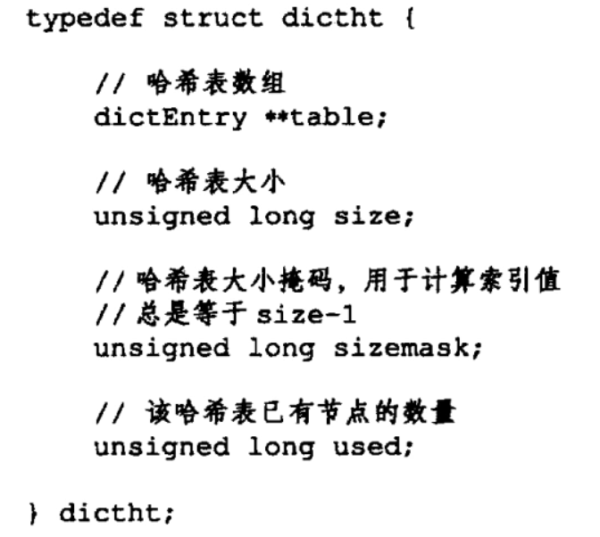
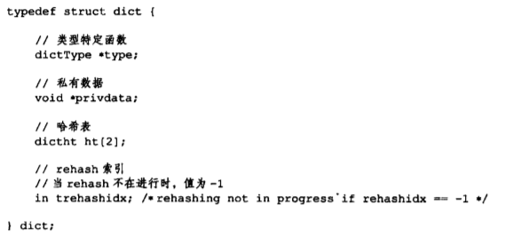

# Redis

## 数据结构与对象

### 对象（数据类型）

redis中创建一个键值对会同时创建两个对象（键对象和值对象），其中键对象固定为一个字符串对象（区分大小写），值对象可以为常见对象中的一种（字符串对象、列表对象、哈希对象、集合对象、有序集合、bitmap、geo地图坐标、stream流等）


- encoding编码属性
  - 指向对象的底层实现数据结构，此方式解决了一种类型固定对应一种编码方式的局限性，可以为以下几种之一：
    - 字典
    - 简单动态字符串
    - long整数
    - 双端链表
    - 压缩列表
    - 跳跃表和整数集合等
  - 每种类型的对象都至少用了两种编码方式来实现
  - 
- *ptr指针
  - 指向底层数据结构，由encoding决定

#### 字符串对象

字符串对象有三种编码方式：

浮点型值在redis中保存为字符串类型

1. int
   - 对象为整数值且可以用long类型表示
2. embstr
   - 对象为字符串值且长度小于32字节
   - 特点
     - 只读，对其进行修改会自动将编码类型转换为raw
     - 与raw都使用redisObject和sdshdr结构，但是在embstr中这两个结构内存中是连续的，能更好的利用缓存带来的优势。
     - 创建embstr时只调用一次内存分配函数来创建这俩结构，释放时也只调用一次内存释放函数。
3. raw
   - 对象为字符串值且长度大于32字节
   - 特点
     - 与embstr都使用redisObject和sdshdr结构，但是在raw中这两个结构内存中不连续的。
     - 创建释放时需要调用两次内存创建和释放函数

浮点型值在redis中保存为字符串类型

#### 列表对象

列表对象有两种编码方式：

1. ziplist
   - 使用压缩列表作为实现，每个压缩列表节点保存了一个列表元素
   - 当列表对象所有字符串元素长度小于64字节且元素数量小于512个时使用ziplist，否则使用linkedlist
2. linkedlist
   - 使用双端链表作为底层实现，每个节点（node）保存了一个字符串对象也就是一个列表元素

#### 哈希对象

哈希对象有两种编码方式：

1. ziplist
   - 使用压缩列表作为实现
   - 添加新键时将保存键和值的两个节点依次保存到压缩列表表尾，这样保证了键和值的对象内存上总是连续
   - 当哈希对象键和值得到字符串元素长度小于64字节且元素数量小于512个时使用ziplist，否则使用hashtable
2. hashtable
   - 使用字典作为底层实现，每个键值对用一个字典键值保存

#### 集合对象

集合对象编码方式有两种：

1. intset
   - 使用整数集合作为实现
   - 当集合对象所有元素全部为整数、数量不超过512个时使用inset，不然用hashtable
2. hashtable
   - 使用字典作为实现，用键来保存集合元素的字符串对象，值全部设置为空

#### 有序集合

有序集合编码方式有两种：

1. ziplist
   - 使用压缩列表作为实现
   - 每个集合元素用两个压缩节点存储，第一个节点存储元素成员，第二个节点存储元素分值，按照分值从小到大排序
   - 当有序集合元素数量小于128个且元素成员长度小于64字节时使用ziplist，否则使用skiplist
2. skiplist
   - 使用zet作为实现，一个zset结构由一个字典和跳跃表构成


### 动态字符串

Redis使用自己的SDS类类型来存储字符串：</br>
 </br>

与C字符串优点：

1. 相比于C字符串（`O(n)`）更方便的获取字符串长度（`O(1)`）
2. 杜绝缓冲区溢出
   - 在修改SDS对象之前会监测SDS对象len属性长度能否满足需求，不能会自动扩展。
3. 减少内存分配次数
   - 在拼接等新增空间操作时，不仅会分配所需要的内存，还会额外分配空余内存。
   - 在删除等减少空间操作时，不会立即释放内存，而是将这部分空余内存计入free空间。
4. 二进制安全
   - redis的buf属性保存的是二进制数据而不是字符，因此可以保存任何数据。
5. 兼容C函数
   - 最后一个字符为空字符，不计算长度，这样可以直接重用部分C字符串函数。

### 链表

Redis内部链表特性：

1. 双端
   - 节点带有pre、next指针
2. 无环
   - 表头节点的pre和表尾节点的next都是null
3. 带表头表尾指针
4. 带长度计数器
5. 多态

### 字典

redis使用哈希表实现字典，哈希表中节点保存了一个键值对

#### 哈希表

数据结构：

</br>
</br>
table属性指向一个hash表数组节点

#### 哈希表节点

</br>

#### 字典

数据结构：



结构图：
</br>

ht是一个数组，包含了多个哈希表项，一般情况下只用ht[0],ht[1]是在对ht[0]做rehash时使用。

#### hash算法

1. 当键冲突时，使用链地址法（分配到同一索引的节点用链表链接，最新的节点放在链表头部）
2. rehash过程
   - 为ht[1]分配空间，空间大小为能够包含两倍ht[0].used属性值的最小2的n次方倍数。
   - 渐进将ht[0]节点重新计算索引分配到ht[1]
     - 分多次将ht[0]里面的值rehash到ht[1],每次对字典进行操作时，将rehashidx索引上的键值对rehash到ht[1],直到rehashidx达到最大值变为-1表示完成rehash操作
     - 渐进rehash过程中，对字典进行**新增操作会直接新增到ht[1]**，**查找、删除、新增会先找ht[0]没找到再找ht[1]**
   - 将ht[1]设置为ht[0]

### 跳跃表

### 整数集合（intset）

集合底层实现方式之一，当集合只包含整数类型时使用。


content数组有3种编码方式，`INSET_ENC_INT16`、`INSET_ENC_INT32`、`INSET_ENC_INT64`，当插入整数大于当前编码方式最大值时需要升级整数集合编码方式，所有contents数组里面的整数都要升级。不支持降级

### 压缩列表

当一个列表键只包含少量列表项且列表项都是小整数或者都是长度比较短的字符串时，redis会使用压缩列表作为列表键的底层实现。


- previous_entry_length
  - 记录了前一个节点的长度，用此实现压缩列表的从表尾向表头遍历
- encoding
  - 记录节点的centent属性保存数据的类型以及长度
- centent
  - 保存节点值，可以是一个整数或者字节数组

#### 新增、删除引发的列表连锁更新

假设当前节点长度介于250-253之前，现在在这个节点前面新增一个超过254的节点，那么这个节点的previous_entry_length长度将由1字节变为5字节才能存放前面新增的节点，从而此节点长度刚好超过254，后续节点的previous_entry_length也将触发更新。

#### 类型检查与多态

redis中有些基础命令可以对所有类型的键执行，有些命令则只能对指定类型键执行，当执行命令时，redis会先判断值对象类型是否支持该命令操作。

对于一个命令，一个类型根据不同的编码实现方案redis会自动识别编码从而调用对应函数，这叫多态。

#### 内存回收和对象共享

redisObject结构内有一个redcount属性记录了该对象被引用数量，对象创建和新程序引用时+1，当这个值为0时对象内存会被释放。

redis只能共享包含了整数值的字符串对象（因为在共享对象前redis需要检验对象是否和需要共享的对象相同，保存字符串和多个值的对象如哈希对象等验证时间太长超过cpu限制），**redis初始化时内部会自动创建0-9999的整数值对象用以共享**。

#### 对象空转时长

redisObject内部还有一个lru属性用于记录对象上次被访问时间，空转时长=现在的时间-lru，在特定设置下

## 单机数据库原理

### 初始化服务器

首先初始化服务器状态数据结构`redisServer`并设定初值，这样才能加载自定义服务器配置到服务器状态数据结构中，进而对其余结构进行初始化(这样避免创建了其余数据结构后由于用户修改了配置导致重新加载)。

初始化工作由`initServerConfig`函数完成，主要工作为：

- 服务器运行id
- 服务器默认运行频率
- 服务器默认配置文件路径
- 服务器运行架构
- 服务器默认端口
- 服务器默认持久化条件
- 服务器默认LRU时钟
- 创建命令表

初始化完成后，优先通过AOF方式还原数据库，其次才是RDB方式，初始化完成后日志打印

```
[5244]  21 Nov 22:43:49.084 * DB loaded from disk: 0.068 seconds
```


### 创建客户端和服务端的链接

redis使用单线程实现，服务端通过I/O多路复用技术来实现同多个客户端通信。**为什么要用单核加I/O复用技术**

1. linux并不是cpu密集型，多线程好处主要是为了充分利用CPU性能，而redis单核也能在1s内处理1百万个用户请求
2. 

服务端数据结构为`redisServer`,客户端数据结构为`redisClient`。

当客户端连接到服务端后，服务器调用连接时间处理器创建`redisClient`，并添加在`redisServer`的`clients`链表属性末尾。


#### `redisClient` 属性

```c
typedef struct redisClient{
    // 套接字描述符；-1表示这是伪客户端，如AOF脚本或者Lua脚本调用；不为-1时表示来源于普通客户端也就是网络请求，此时值递增。
    int fd;
    
    // 客户端名字；默认指向NULL，可更改
    int *name;
    
    // 标志位：记录了客户端角色和状态
    // 为单个或者多个二进制值，格式 flags = <flag1> | <flag2>|...
    int flags;
    
    // 输入缓冲区：保存客户端发送的命令请求。
    // 大小自动调整，不能大于1GB
    sds querybuf;
    
    // 存放要执行的命令
    // 数组格式，元素为字符串对象StringObject，第一个元素为要执行的命令，后面元素为其参数
    robj **argv;
    // 记录argv的长度
    int argc;
    
    // 输出缓冲区（固定大小）
    // 大小为REDIS_REPLY_CHUNK_BYTES的字节数组，REDIS_REPLY_CHUNK_BYTES = 16*1024 字节也就是16KB
    // 当超出此数组最大范围时使用可变大小缓冲区*reply
    char buf[REDIS_REPLY_CHUNK_BYTES];
    // 记录固定大小缓冲区bug数组已使用大小
    int bufpos;
    // 可变大小缓冲区(链表)
    list *reply;
    
    // 身份认证标志位
    // 1表示通过，0表示未通过(拒绝除了AUTH以外所有请求)
    int authenticated;
    
    // 记录客户端创建时间
    time_t ctime;
    // 记录客户端与服务端最后一次交互时间，可用于计算客户端空转时长
    time_t lastinteraction;
    // 记录输出缓冲区第一次到达软性限制时间
    time_t obuf_soft_limit_reached_time;
    
    //保存执行命令所对应的数据结构
    redisConmmand *cmd;
}
```

### 请求处理过程

#### 命令接收传递流程

当客户端发送一个请求如`SET KEY VALUE`，客户端将此命令转换为协议发送给服务器


因为受到请求套接字状态变为可读

1. 服务器将调用请求处理器**读取请求**，并将其**保存到`redisClient`中的输入缓冲区`querybuf`**
   
2. **提取输入缓冲区中的命令**分析后将命令和参数格式化**存入`redisClient`中的`argv`属性**
   
3. 调用命令执行器**执行命令**

#### 命令执行器处理流程

1. 查找命令实现

   通过`redisClient`中的`argv[0]`属性中的命令方法在命令表中查找命令，然后将命令保存到`redisClient`中的`cmd`属性中。命令的大小写不敏感，因为命令表使用的是大小写无关查找算法。
   

2. 执行预备操作（单机模式下）

   收集到所要执行的命令相关信息后，在执行之前需要做一些检查工作；

   - 检查**命令是否正确**`cmd`指针指向是否为`NULL`，如是则返回错误
   - 检查**命令参数个数是否正确**：`cmd`指针指向的`redisCommand`结构中的`arity`属性与命令是否相符
   - 检查**客户端是否通过身份认证**
   - 检查**服务器内存是否能够提供服务**：服务器打开了maxmemory功能的话会先检查服务器内存占用情况，并在有需要的时候进行回收
   - 检查**服务器当前状态是否可执行**：
     - 当服务器上一次执行`BGSAVE`命令出错且打开了`stop-writes-on-bgsave-error`功能，此时如果请求是写命令则拒绝执行；
     - 当服务器正在进行数据载入，那么命令都将被拒绝执行除非带有1标识（INFO、SHUTDOWN和PUBLISH等）
     - 当服务器因为执行lua脚本而进入阻塞状态时，那么只会执行`SHUTDOWN` `nosave`和`SCRIPT KILL`命令
     - 如果客户端正在执行事务，那么只会执行`EXEC`、`DISCARD`、`MULTI`、`WATCH`四个命令，其余将会被放入事务队列
     - 如果客户端正在用`SUBSCRIBE`命令订阅频道或者订阅模式，则只能执行`SUBSCRIBE`、`PSUBSCRIBE`、`UNSUBSCRIBE`、`PUNSUBSCRIBE`四个命令
   - 检查**是否打开监视器功能**：如打开将会把命令相关信息发送到监视器

3. 调用命令执行函数

   完成执行命令前的检查工作后，因为所要执行命令的相关信息都已经存入argv属性中，只需要一个指向client的指针就可以直接执行命令

   

   命令执行完成后回复将会放入输出缓冲区中，执行函数为客户端套接字关联命令回复处理器负责返回回复给客户端

#### 命令执行信息返回流程


### redis定时时间任务

#### `serverCron`函数

此函数负责管理服务器的资源，每隔100秒执行一次

1. 更新**服务器时间**缓存和**LRU时钟**缓存

   因为redis中不少功能都需要获取系统时间，所以为了减少系统调用，将当前时间存入服务器状态缓存中

   ```c++
   struct redisServer{
       // 保存秒级精度UNIX时间戳
   	time_t unixtime;
       // 保存毫秒精度UNIX时间戳
   	long long mstime;
       
       // LRU时钟，用于计算键（redisOeject）空转时长，每10s更新一次
       // 每个键（redisOeject）都有一个lru属性记录最后一次访问时间，lruclock - lru 即为该键空转时间
       unsigned lruclock:22;
   }
   ```

2. 更新服务器**每秒执行命令次数**与**内存峰值**与**本函数`serverCron`执行计数器**

   通过`trackOperationPerSecond`函数每100s计算一次实现，计算值为两次时间差的平均值

   ```c++
   struct redisServer{
       // 上一次取值时间
   	long long ops_sec_last_sample_time;
       // 上次取值时命令数量
   	long long ops_sec_last_sample_ops;
       
       // 记录每次取值结果的环形数组，每一个元素代表一次取值结果，REDIS_OPS_SEC_SAMPLES = 16
       long long ops_sec_sample[REDIS_OPS_SEC_SAMPLES];
       
       // ops_sec_sample索引，到16时变为0，自增
       int ops_sec_idx;
       
       // 已使用内存峰值记录
       size_t stat_pack_peak_memory;
       
       // 本函数`serverCron`执行计数器
       int cronloops;
   }
   ```

3. 管理客户端状态

   通过`clientsCron`函数实现：

   - 检查**客户端状态空转时间**，超时释放该客户端
   - 检查**客户端输入缓冲区大小**，如果超过一定长度则释放并新建一个输入缓冲区

4. 管理数据库资源

   通过databaseCron函数实现：

   - 检查数据库中**过期键**并删除，在需要时**对字典进行收缩**

5. 执行被延迟的`BGREWRITERAOF`

   如果有因为服务器执行**BGSAVE**所延迟的**BGREWRITERAPF**命令，当前无**BGSAVE**和**BGREWRITERAOF**命令在执行，则执行被延迟的**BGREWRITERAOF**命令

   ```c++
   struct redisServer{
      // 记录是否有延迟的BGREWRITERAPF命令
      int aof_rewrite_scheduled;
   }
   ```

6. 检查持久化操作状态

   ```c++
   struct redisServer{
      // BGSAVE子进程ID,值为-1表示当前无进程再执行
      pid_t rdb_child_pid;
       
      // BGREWRITERAOF子进程ID，值为-1表示当前无进程再执行
      pid_t aof_child_pid;
   }
   ```

   - 两个属性值当前有一个不为-1

     表示正在执行操作，程序会执行wait3函数监听子进程是否有消息：

     - 有消息表示新的RDB文件或者AOF文件写完成，需要进行后续rdb和aof文件替换操作
     - 无消息程序表示持久化进行中

   - 两个属性值皆为-1

     表示持久化操作完成，判断是否需要执行持久化操作：

     ​	

7. 将AOF缓冲区中内容写入AOF文件

8. 关闭**输出缓冲区大小超出限制**的客户端

   如果超出输出缓冲区**硬性限制大小**，立即关闭；如果**超出软性限制大小但没超过硬性限制大小**，且持续时间超过规定时长则进行关闭。以上所有参数皆可设置

### 数据库

redis中的数据库信息默认存放在`redisServer`结构中，初始化服务器时默认创建16个数据库，`redisClient`中也有指针指向所使用的的数据库，使用过程中可以切换，默认使用0号数据库。

#### 数据库内部结构

redis中使用redisDB结构表示数据库

```c
struct redisDb{
   // 数据库键空间，保存数据库中所有键值对
   dict *dict;
    
   // BGREWRITERAOF子进程ID，值为-1表示当前无进程再执行
   pid_t aof_child_pid;
}
```


当用户读写一个键的时候需要额外进行的操作：

1. 成功读取键后更新键空间命中次数，更新键LRU时间，如果键过期则先删除键；
2. 更新键后标记为dirty或者对已标记的dirty进行+1，用于支持事务；

#### 键过期策略

键过期时间可以手动进行设置，设置了之后`redisDb`结构中`expires`字段存储各个键的过期时间。


当建过期的时候，有三种删除策略：

1. 定时删除
   - 创建过期时间时设置定时器，**到时间立即删除**
   - 当过期键过多会占用cpu，且当前时间事件采用无序链表实现，查找事件的时间复杂度为**O(N)**
2. 惰性删除
   - 到期了不立即删除，而是等到**下次获取该键之前进行检查时删除**
   - 好处是不会额外增加操作流程，在读取键时顺便删除；坏处是过期键任然会存在内存中。
3. 定期删除
   - 定时任务**隔一段时间检查一次**，删除过期键。

redis使用**惰性删除**和**定期删除**两种方式配合。

#### AOF和RDB中对过期键的处理

RDB文件

1. 生成RDB文件时不会把过期键写进去
2. 载入RDB文件时如果是主服务器模式则只会载入未过期键，从服务器模式则全都载入

AOF文件

1. 当过期键被删除后，会向AOF文件追加删除命令显示记录
2. AOF重写的时候过期键均不会保存到AOF中

从服务器的键过期由主服务器控制

### RDB与AOF持久化

redis是内存数据库，重启电脑后数据库状态就没了，所以需要定期将数据库状态写入磁盘。RDB文件是类似mysql的模式，文件内部保存了所有数据库状态。AOF文件则是保存了对数据库的操作语句。

AOF更新频率比较高，所以优先级比RDB高，在服务器启动时会优先使用AOF还原数据。

#### RDB持久化

生成RDB文件有两种方式：

1. SAVE命令
   - SAVE命令会阻塞进程直到RDB文件创建完成
2. BGSAVE命令
   - BGSAVE命令**不会阻塞服务器进程**，会fork一个子进程负责创建RDB，创建过程中新增的命令会被写入一个缓冲区，等到子进程创建完RDB文件后再将这些创建时新增的命令写入RDB文件。

载入RDB是在服务器启动过程中完成，中途无法载入。

服务器自动SAVE的条件可以手动设置多个，保存在`redisServer`结构中，此外还会保存距离上一次save过程中服务器状态修改次数。

```c++
struct redisServer{
   // 保存save命令执行条件
   dict *saveparame
    
   // 距离上次save命令过程中数据库状态修改次数
   int dirty;
    
   // 上次执行save命令时间戳
   time_t lastsave;
}
```

RDB文件保存格式


#### AOF持久化

AOF采用保存操作命令的方式实现持久化，类似mysql二进制日志模式。在执行一个写命令时会将命令写入`aof_buf`缓冲区中。

AOF文件生成：

- redis每次loop循环最后都会对`aof_buf`缓冲区进行检测，如果需要则将内容写入AOF文件
- 可以设置将缓冲区内容写入AOF文件的策略
  - always：将所有内容写入并同步AOF
  - everysec：将所有内容写入AOF，上次同步到现在时间超过1s则进行同步
  - no：将所有内容写入AOF，同步时间由操作系统决定

AOF文件载入：


当运行时间久了AOF文件会很大，之前有的键可能在过程中被删除，这样就可以对AOF文件进行精简重写。重写后的AOF只会包含生成当前数据库状态必须的命令。

重写AOF文件由子进程实现，这样可能导致重写过程中有新命令到达，导致状态不一致。为了避免这种情况使用AOF重写缓冲区来实现，类似上文提到的`aof_buf`缓冲区


## 主从复制

复制主要有两个阶段：

1. 将从服务器状态更新为主服务器状态（`SYNC`）
2. 主服务器执行命令时把命令传播给从服务器

### 旧版复制原理


然而旧版在服务器断连后需要再重新生成所有键值对的RDB，这样成本太高了，假设只断开3s却要复制所有数据库键值对，很蠢。

### 新版复制原理

为了解决旧版在断连时复制所有键值对的愚蠢，新版新增了一个`PSYNC`（部分重同步）功能，只用同步断连前上一次同步到重连上这段时间的变化。


新版实现方式：

1. 服务器维护一个偏移量滑动窗口队列，当主服务器执行一条命令会把命令与其对应的偏移量存入队列末端，并移出队列头。
2. 断连后的从服务器重连上时发送PSYNC命令并携带自己当前的偏移量，主服务器会把从这个偏移量开始的命令都同步给从服务器。如果队列里面找不到这个偏移量说明断了很久，执行全量同步。
3. 此外还需要考虑如果断开连接后连上的不是之前那个服务器的情况，这种情况下需要执行全量同步。从服务器在初次进行同步时会存储主服务器发过来的主服务器ID，后面每次同步都带上，这样同步时主服务器就知道这个从服务器之前是不是自己的从服务器。

### 复制实现过程

向一个从服务器发送**`SLAVEOF`**命令设置主服务器实现过程：

1. 从服务器把主服务器的**ip**和**端口**信息存入`redisServer`结构
2. 从服务器根据ip和端口信息和主服务器**建立套接字**链接
3. 通过套接字ping，测试链接是否正常
4. 验证身份（可选）
5. 从服务器向主服务器发送端口和ip信息并存储在主服务的`redisClient`中
6. 执行同步命令，此步骤主从服务器会互相称为对方的客户端，因为要互相发送命令
7. 一直维持命令传播......

从服务器会每隔一秒向主服务器发送带有自己当前偏移量的**心跳检测**包，主服务器如果接收到偏移量和自己偏移量不符合的包就对从服务器进行部分重同步。


## sentinel（哨兵机制）

sentinel用于保证redis的高可用，负责监视主服务器以及其下属从服务器。并在当主服务器出问题时在从服务器中选举出一个作为新的主服务器，且将其设置为其他从服务器的新主服务器。当旧主服务器新上线时会自动成为新主服务器的从服务器。

#### 启动sentinel过程

1. 初始化redis服务器
2. 替换redis代码为`sentinel`专用代码
3. 初始化sentinel状态
   - 初始化`sentinelState`结构
4. 根据配置文件加载要监视的主服务器
   - 创建`master`字典存储主服务器信息，加载`sentinelRedisInstance`结构存储主服务器实例相关状态。
   - 
   - 
5. 创建与主服务器之间的链接
   - sentinel会向每个主服务器创建两个链接，并成为主服务器的客户端
   - 

#### sentinel获取主从服务器信息

sentinel会每隔10s向主服务器发送INFO命令，此命令会返回主服务器id信息和其下属从服务器信息，sentinel会将从服务器更新存储到对应主服务器的`sentinelRedisInstance`结构的`slaves`属性中，可以看到从服务器的name字段是由其ip和端口组成的：


当检测到新的从服务器后sentinel会为其创建`sentinelRedisInstance`结构，并也会每隔10s向其发送INFO信息，并根据INFO信息的返回值更新其信息。其中返回信息包括从服务器的run_id、角色role、优先级、复制偏移量以及其主服务器。


#### sentinel发送和接收主从服务器消息

每隔sentinel会每隔2s向自己结构中存储的主从服务器的`__sentinel__:helle`频道**通过命令链接**发送消息，这消息包含了该sentinel的信息和主从服务器对应的主服务器信息；并且建立**订阅链接接收**服务器的订阅消息。


因此可以知道一个sentinel会接收到其他sentinel发送给服务器的命令，此时sentinel会在自己的sentinel字典中存储其他sentinel信息，同时会与新发现的sentinel节点建立链接：


#### 主客观下线以及sentinel选举

sentinel会以1s一次的频率向创建了连接的主从服务器与sentinel发送ping命令，一旦在预先设置的时长内对象没有有效回复（PONG、LOADING、MSTERDOWN）则判定主观下线，其sentinelRedisInstance结构的flag状态添加下线标志位。

判断为主观下线后，向其他sentinel发送命令（is mater-down-by-addr）查询此服务器状态是否下线，如果接受到反馈状态为下线的sentinel数量大于预先设定的客观下线判断数量，则设置为客观下线状态。

不同判断条件的sentinel主客观下线状态可能会不一致。

当一个节点判断一个服务器客观下线后，需要选举出一个sentinel头出来对服务器进行下线操作。在一个sentinel判定服务器为主观下线并想其他sentinel发送命令（is mater-down-by-addr）时，会同时设置其他sentinel的领头sentinel为自身。当超过一半sentinel的领头都是自身时完成选举。

#### 故障转移

完成sentinel选举后，对下线服务器进行故障转移：

1. 在从服务器中列表挑选一个作为新的主服务器
   - 挑选条件（在线->5s内回复过INFO信息->主从服务器连接未断开超过指定时间）
   - 符合条件的服务器排序条件：最高优先级（高）->从服务器偏移量（大）->ID（小）
   - 在向挑选出来的从服务器发送设置为主服务器的命令后，每秒向其发送`INFO`命令（之前每10s）观察role信息是否更改为master
2. 修改剩下从服务器的主服务器为新主
   - 向剩下的从服务器发送`SLAVE OF`命令
3. 下线的旧主服务器上线时成为新住的从服务器

## 集群

集群指的是多个redis工作在同一层级关系下（不是主从），向其中一个节点A发送`CLUSTER MEET <ip> <port>`命令将对方节点和节点A纳入一个集群下。命令执行过程：

1. 节点A收到命令时会在自己的`clusterState.nodes`字典为节点B创建一个`clusterNode`节点存储对方节点信息
2. 节点A向节点B发送meet消息
3. 节点B收到消息为节点A创建一个`clusterNode`节点存储对方节点信息
4. 节点B返回PONG消息
5. 节点A返回PING消息


每个节点都会有一个`clusterNode`结构存储自身信息，也会有一个`clusterState`结构存储集群当前信息，其中myself指针指向当前自身节点


### 槽指派

集群模式下，redis将数据库分为16384个槽，每个槽都必须映射有节点集群才能正常上线。槽的具体分配信息存储在`clusterNode`结构中：

```c++
struct clusterNode{
   // 二进制位数组，长度为16384/8也就是2048字节，包含16394个字节，数组对应字节位数上面的值为1表明此节点负责对应的槽
   unsigned char slots[16384/8]
    
   // 存储此节点负责的槽的总数量
   int numslots;
}
```

因为数组的节点访问时间复杂度O(1)，所以检查当前节点负责某一个槽的时间复杂度也是O(1)。

节点会将自己所负责的槽信息发送给别的节点，节点收到别的节点发送过来的槽负责信心会更新自身`clusterState.nodes`字典中对应节点的`clusterNode`信息，这样每个节点都知道集群所有槽指派信息。

此外，`clusterState`结构中还有专门的字段slots数组统一存储节点槽信息，对应槽指针指向负责节点，这样程序查询对应槽被指派的节点时间复杂度变成O(1)：


所以当执行槽指派命令时，需要同时更改`clusterState.slots`和`clusterNode.slots`两处：


### 集群下命令执行

数据库不同的槽被分配到各个节点后，执行命令过程是怎样的呢？


1. 首先接收到命令通过CRC(16)计算key的CRC-16效验和，和16383进行与操作得出槽号。
2. 计算出key的槽号后通过查询节点的`clusterState.slots`数组对应槽元素属性是否指向自身的`clusterNode`判断槽号是否由自己负责
3. 如果槽不是本节点处理，则会向客户端发送一个MOVE命令，让其向槽对应节点重定向发送命令

### 重新分片与ASK错误

redis可以对槽重分配：


但是此方法存在一个问题：如果正在迁移过程中客户端请求正在迁移的键会怎么办呢？迁入节点在`clusterState`结构中使用`importing_slots_from`属性来存储正在迁移过来的槽信息，迁出节点用`migrating_slots_to`属性存储正在迁出的槽信息


当节点收到key请求，而且槽也与本节点对应。但是并没有在数据库里面找到对应key的话，会去检查`clusterState.migrating_slots_to`属性是否正在迁出相应槽，如果是那么会发送一个**ACK错误**（类似MOVE的重定向错误），然后客户端向新的节点发送ASKING命令，此命令主要是为了打开服务器的`REDIS_ASKING`标识，只有打开了这个标识正在迁入的节点才会去检查正在迁入的槽信息。


